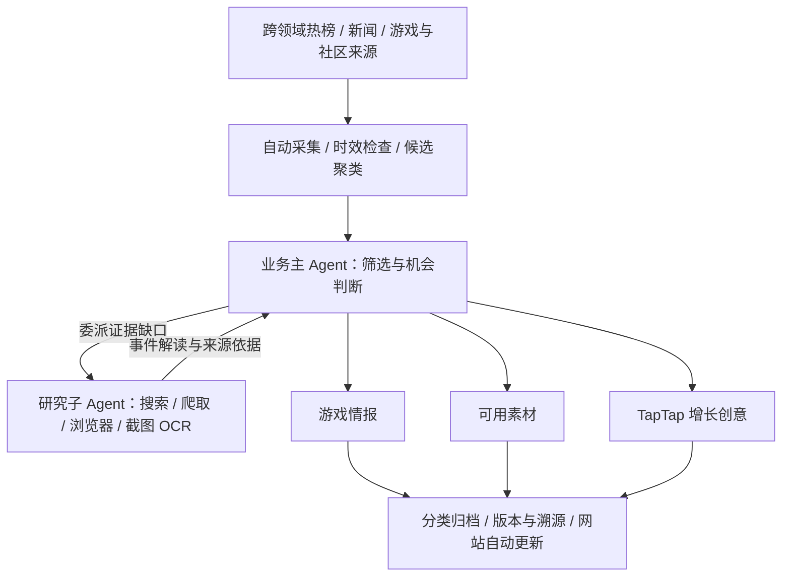

# TapTap 热点情报与素材系统

**持续从全网热点中，为 TapTap 找增长机会、提供情报、创意和可用素材的 AI Agent 系统。**

[](docs/版本记录.md)
[](https://github.com/hccccc01333/taptap-hotspot-intel/actions/workflows/ci.yml)
[](https://github.com/hccccc01333/taptap-hotspot-intel/actions/workflows/pages.yml)

[**打开在线网站 →**](https://hccccc01333.github.io/taptap-hotspot-intel/) · [版本记录](docs/版本记录.md) · [运行与部署](docs/V3-GitHub部署与成果同步.md)

这是一个面向 TapTap 内容与运营场景的个人 Agent 开发项目。系统先发现社会、娱乐、文化、生活方式和游戏领域的近期话题，再判断它们能否形成游戏情报、可用素材或 TapTap 增长机会。使用者打开网站查看已经归类的成果，需要核查时再回到解读和来源。素材和创意支持搜索、弹窗阅读、复制及下载 Markdown 稿件，使用边界与来源随稿保留。


<sub>2026-10-08 线上真实成果页。截图中的数量属于当时的运行快照，以网站最近同步时间为准。</sub>

## 系统交付什么

| 入口 | 你能看到的成果 |
| --- | --- |
| 热点发现 | 说明“谁发生了什么”的标题、一句话概括，以及有依据的热点解读 |
| 事件跟踪 | 背景、时间线、讨论焦点、质疑与后续进展；尚未确认的事项自动安排补查 |
| 情报档案 | 游戏变化、玩家需求、社区创作、市场动向与风险观察，说明为什么值得 TapTap 关注 |
| 素材库 | 可编辑的文案、脚本、表达模板和游戏改编，附使用场景、替换方法、来源及使用边界 |
| 增长创意 | 面向谁、用什么创意、怎样传播、如何承接到 TapTap、引导什么动作，以及制作和执行方案 |

热点可以来自游戏之外。情报与素材需要有具体游戏场景，或具备合理的游戏改编方式。**情报、素材和创意分别判断，允许某项没有产出**；不会为了填满页面，强行把每个热点改写成推广方案。

## Agent 如何工作

系统采用一个业务主 Agent 和一个所属研究子 Agent。主 Agent 负责筛选、委派、业务判断及交付；研究子 Agent 专门补齐事件内容，按缺口使用联网搜索、爬虫、浏览器读取、评论区滚动、截图与 OCR。



- **自动推进**：采集、初筛、深度研究和成果同步在后台运行；浏览页面不触发生产任务。
- **持续补查**：未确认事项进入持久队列，带证据解决、退避重试或等待新来源，再写回原事件。
- **区分时间与事件**：近期采集时间不等于事件发生时间；旧内容重新升温需要新的热度依据。同一事件与后续进展分别处理。
- **保留判断边界**：事实、引用、推测与原创改编分别记录。模型最终输出经过结构和来源校验，推理过程不作为业务成果。
- **控制传播风险**：负面、争议、风险未确认及中高风险事件不生成推广创意和传播素材；可保留中立风险情报。
- **理解 TapTap 场景**：覆盖移动端生态与 PC 业务，区分游戏实际平台、社区需求及尚待确认的承接资源。

## 在线网站与自动更新

[GitHub Pages 网站](https://hccccc01333.github.io/taptap-hotspot-intel/)展示真实 Agent 成果，无需登录。

| 更新内容 | 更新方式 |
| --- | --- |
| 页面与前端功能 | `main` 推送相关源码后，GitHub Actions 自动检查、构建并部署 |
| 情报、素材和创意 | 本地后台每五分钟检查成果变化，自动同步到独立的 `site-data` 分支 |
| 使用者看到的内容 | 网站每分钟读取最新成果；无新成果时，后台每小时同步运行心跳 |

**当前后台在本地电脑运行。** GitHub Pages 不执行 Python、采集或模型任务。电脑关闭后，网站保留最后一次成果；超过90分钟未同步时显示提示。常驻云端运行尚未部署。

公开页只发布整理后的交付、短引用和来源链接。完整原文、评论、截图、账号身份、SQLite、密钥及模型运行记录留在本地；本地工作台保留更完整的溯源能力。部署配置与失败重试见[说明文档](docs/V3-GitHub部署与成果同步.md)。

## 本地运行

需要 Python 3.11+、Node.js 和 npm。完整截图 OCR 当前使用 Windows OCR；浏览器研究还需要 Playwright 及可用浏览器，详见[工具配置](docs/V3-研究工具与自动队列.md)。

```bash
git clone https://github.com/hccccc01333/taptap-hotspot-intel.git
cd taptap-hotspot-intel
python -m pip install -r requirements.txt
cd spatial
npm ci
```

在系统或用户环境变量中设置 `DEEPSEEK_API_KEY`，然后在项目根目录选择模型与预算：

```bash
python -c "from agent_v3.store import Store; s=Store(); s.set_model('deepseek-flash'); s.set_reasoning('low'); s.set_output(16384); s.close()"
python -m uvicorn webapp.main:app --host 127.0.0.1 --port 8202
```

另开终端，在 `spatial` 目录启动前端。以下为 PowerShell 命令：

```powershell
$env:VITE_DEV_API_TARGET = 'http://127.0.0.1:8202'
npm run dev -- --host 127.0.0.1 --port 5182 --strictPort
```

打开 `http://127.0.0.1:5182/`。本地开发账号为 `运营A` 或 `观察E`，密码 `demo`；它们用于本机开发，不应作为公网 API 的认证配置。后台启动后自动调度，既有启停偏好会保留。运行数据位于 `data/v3/`，不会提交到 GitHub。

生产默认推理强度 `low`，单次总输出预算16,384 token，包含推理和最终输出。DeepSeek 接入、响应字段隔离与实际模型名称见[模型文档](docs/V3-DeepSeek.md)。模型调用需要自己的可用额度。

## 当前验证与边界

V3 已通过358项后端回归、TypeScript 检查、前端生产构建及线上桌面／移动端浏览验收。已有真实采集、研究、游戏情报、可编辑素材和增长创意任务，版本和失败记录可追溯。

项目仍处于 **Alpha**：来源覆盖有限，反爬及评论读取可能失败；增量聚类、候选筛选效率、热点质量和创意适配仍需打磨。增长创意是附带依据和执行条件的可测试草案，**尚未验证实际增长效果**。截图 OCR 可能识别错误，不能把识别文本直接当作已核实事实。

## 代码与文档

| 位置 | 作用 |
| --- | --- |
| `agent_v3/` | 主 Agent、研究子 Agent、工具、持久任务、契约校验、业务库与自动调度 |
| `spatial/` | React + TypeScript 前端，默认 V3 工作台，保留 V1／V2 入口 |
| `webapp/` | FastAPI 服务与本地认证接口 |
| `L1_data_source/` | 采集器与来源适配 |
| `scripts/` | 公开成果导出、版本快照等辅助工具 |
| `docs/` | 设计、实测、部署与版本记录 |

- [自动交付与补查闭环](docs/V3-自动交付与补查闭环.md)
- [热点解读与游戏交付契约](docs/V3-热点解读与游戏交付契约.md)
- [正负面热点与评论补采](docs/V3-正负面与评论补采.md)
- [主 Agent 与所属研究子 Agent](docs/V3-主Agent与研究子Agent.md)
- [GitHub 部署与成果同步](docs/V3-GitHub部署与成果同步.md)
- [版本记录与历史验收](docs/版本记录.md)

V1、V2 及 V3 历次改动保留在 Git 历史和版本文档中，历史验收结论以当时版本为准。
