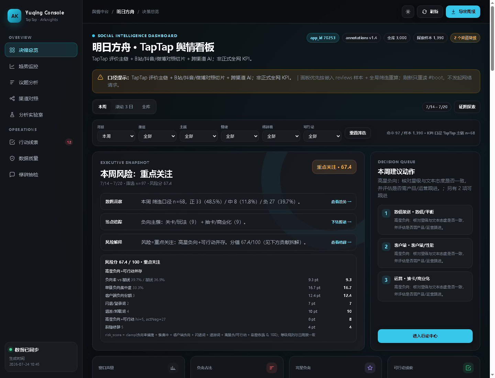

# 明日方舟 · TapTap 玩家情报 Agent

[](https://github.com/hccccc01333/arknights-taptap-intel-agent/actions/workflows/ci.yml)
[](https://www.python.org/)
[](./LICENSE)
[](./skills/)

面向《明日方舟》玩家评价的**每日情报 Agent**：采集 → 清洗 → LLM 结构化标注 → 风险分层 → 决策路由 → 当日简报；叠加 B 站 / 抖音 / 微博对照。全程 **facts 锁数**——数字由代码计算，LLM 不生成任何数字。

| 项 | 内容 |
|----|------|
| 主链 | TapTap《明日方舟》评价（app_id=70253） |
| 数据面 | 四条通道分目录：评分区评论 / 单游戏社区（帖子+热评）/ 平台级发现流（话题热榜→话题下帖子）/ 用户社区足迹（跨游戏流向） |
| 隐私 | 用户标识加盐哈希（HMAC-SHA256，盐不入库）；分析层**只出聚合**，产出不含单个用户标识或轨迹 |
| 情报 Agent | 感知 → 决策（规则兜底 + LLM 可选）→ 行动 → 简报；显著异动触发深挖 |
| 风险分层 | 舆情侧流失风险信号：高投入不满 / 高投入不推荐 / 修辞伪装负向 / 可行动差评 |
| 标注 | v1.4 两段式：字面 / 意图 / 主情绪 / 修辞分通道 |
| 游戏档案 | [`games/<key>.json`](./games/README.md) 驱动 app_id / 阈值 / 等价名 / 跨渠关键词——换档案即换游戏 |
| Skills | [`skills/`](./skills/README.md)：5 个 Agent Skills |
| 架构 | **分层目录（2026-10-01 重排）**：L1 采集 → L2 信号 → L3 语义 → L4 决策 → L5 生成 → L6 交付；控制面 `runtime/`、数据湖 `data/`。详见 [分层结构](#分层结构) |
| 判据 | 热点是否值得社区做话题，用「**社区可发酵度**」判断（`ferment_judge`），不是「是否属于我建档的游戏」——实测旧判据命中 0/10，新判据认为 5/10 可发酵 |

> 社交三渠为限量对照；降级语料会在 facts / 看板标明，不作全网 KPI。

**快速入口：** [打开看板](./L6_delivery/dashboard/index.html) · [每日情报简报](./L6_delivery/briefing/reports/daily_intel_latest.md) · [Agent v2 架构设计](./docs/Agent-v2-架构设计.md) · [方法论](./docs/方法论.md) · [构建说明](./docs/构建说明.md)

---

## 分层结构

> 2026-10-01 重排：原有 `01爬虫 / 02数据 / 03标注结果 / … / 11情报Agent` 按**职责**重排为分层目录。
> 回滚点：`a358a06`（重排前快照）。

| 层 | 目录 | 职责 | 有没有 Agent |
|---|---|---|---|
| **L1** | `L1_data_source/` | **信号采集**：各平台 → 统一 Content Event | ❌ 纯 Data Engineering |
| **L2** | `L2_signal/` | **加工与语义标准化**：Canonical Model、清洗去重、实体链接、指标归一 | ❌ 默认不用 LLM |
| 语义加工 | `L3_semantic/` | 语义理解：标注 v1.4、公告结构化（第二层的语义部分） | ✅ LLM 标注 |
| **L3** | `L3_trend/` | ★ **趋势智能**（Data Science Core）：事件聚类、速度/加速度/爆发、Hot/Momentum/Confidence、生命周期、闭环调频 | ➖ 规则 + 统计 |
| **L4** | `L4_intelligence/` | ★ **AI 情报与增长推理**（Agent Intelligence）：Evidence 事实层级、Trend Analyst、TapTap Relevance、Audience/Motivation、Opportunity、Growth Hypothesis、Creative、Evaluator+Risk、人工闸门（LangGraph 编排） | ➖ 规则兜底（无 key） |
| **L5 记忆** | `L5_memory/` | ★ **知识与增长记忆**：6 类 Memory（业务/实体/趋势/创意/实验/决策）、混合检索、Growth Case 蒸馏、Anti-pattern、Playbook（人工审批）、写入策略与 PII 治理 | ➖ 治理管道，LLM 可选 |
| **L5 生成** | `L5_generation/` | 生成：素材库、创意、洞察 | ✅ |
| **L6** | `L6_delivery/` | 交付：简报 / 日报周报 / 看板 / 渠道对照 | ➖ 渲染 |
| 控制面 | `runtime/` | harness / 任务契约 / LangGraph 图 / 调度 | ➖ |
| 数据 | `data/` | raw / events / annotations / facts / state / outputs | — |
| 共享 | `common/`、`paths.py` | 跨层工具与**唯一路径出口** | — |

- 跨层一律走 `paths.py`（`ROOT` / `RAW` / `EVENTS` / `load_module(name, layer=...)`），
  不再各写一份 `Path(__file__).parents[N]` —— 重排时这种写法全部错位过。
- L1 已跑通：4452 条原始数据 → 4451 条 Content Event，详见 [`L1_data_source/README.md`](./L1_data_source/README.md)。

---

## 解决什么问题

运营侧从海量玩家评价里要看到的不只是情绪结构，而是三件事：**每天该看什么**（异动是否显著）、**该防什么**（负向风险是否集中在高投入玩家）、**该转给谁**（哪些吐槽可以转成具体运营动作）。难处在于：讽刺 / 高级黑 / 反串等伪装话术会被「单字段正负」漏掉，异常波动会被抽样噪声淹没，而 LLM 生成的报告里数字最容易失真。

本仓库的处理方式：

1. **结构化标注打底**：DeepSeek JSON 输出，v1.4 两段式标注（先挖字面之下的线索，再判整体态度），字面 / 意图 / 主情绪 / 修辞分通道——反话、阴阳、高级黑、反串单独识别。
2. **风险分层**：按「高投入不满（≥100h 玩家的负向）、高投入不推荐、修辞伪装负向、可行动差评」四层切分，并按数值、活动、商业化、性能、玩法等主题映射干预方向。
3. **每日情报 Agent**：感知（代码算 facts）→ 决策（显著性检验 + 规则引擎兜底，LLM 可选）→ 行动（显著异动触发深挖，否则常规监测）→ 简报。LLM 不生成任何数字，依赖异常时自动降级并写明原因。
4. **可复现交付**：日 / 周报（四问法 + 执行摘要；薄样本禁写环比）、跨渠道 facts 锁数综合、离线 HTML 看板；TapTap 采集带字段契约与断点续跑。

---

## 技术栈

| 类别 | 选用 |
|------|------|
| 语言 / 数据 | Python、Pandas（清洗 / 异动分解） |
| 情报 Agent | **纯标准库实现**（两比例 z 检验 / Wilson CI / facts 锁数），零第三方依赖 |
| LLM | DeepSeek API（可选增强：决策与定性；无 Key 时规则引擎 + 模板全链路可跑） |
| 交付 | Markdown 报告、离线 HTML 看板 |
| 质量 | 475 个单元测试（stdlib unittest，分布在各层 `tests/`）+ CI（测试 / 报告重建 / 堆栈与 PII 卫生检查） |
| Agent | [Agent Skills](https://agentskills.io)（`skills/*/SKILL.md`） |

---

## 效果预览



*离线看板首屏：本周风险评级、洞察链路、高风险主题与决策队列。*

| 产出 | 入口 |
|------|------|
| 每日情报简报（异动决策 + 深挖） | [`L6_delivery/briefing/reports/daily_intel_latest.md`](./L6_delivery/briefing/reports/daily_intel_latest.md) |
| 流失风险分层 | [`L6_delivery/briefing/reports/risk_insight_latest.md`](./L6_delivery/briefing/reports/risk_insight_latest.md) |
| 跨游戏同口径对比 | [`L6_delivery/briefing/reports/cross_game_compare_latest.md`](./L6_delivery/briefing/reports/cross_game_compare_latest.md) |
| 单游戏社区话题流 | [`L6_delivery/briefing/reports/community_insight_wuthering-waves_latest.md`](./L6_delivery/briefing/reports/community_insight_wuthering-waves_latest.md) |
| 平台级发现流（事件信号） | [`L6_delivery/briefing/reports/platform_insight_latest.md`](./L6_delivery/briefing/reports/platform_insight_latest.md) |
| 用户流动（跨游戏流向 / 投入度×流动） | [`L6_delivery/briefing/reports/user_flow_wuthering-waves_latest.md`](./L6_delivery/briefing/reports/user_flow_wuthering-waves_latest.md) |
| 日 / 周报终稿 | [`L6_delivery/period_reports/reports/`](./L6_delivery/period_reports/reports/) |
| 跨渠道综合简报 | [`L2_signal/cross_channel/reports/`](./L2_signal/cross_channel/reports/) |
| 离线看板（双击即开） | [`L6_delivery/dashboard/index.html`](./L6_delivery/dashboard/index.html) |

---

## 快速开始

- Python 3.10+；**情报 Agent 模块零依赖**，clone 后无需安装任何包即可运行
- （可选）`DEEPSEEK_API_KEY`：标注 / 跨渠 LLM 综合 / Agent 的 LLM 决策与定性；无 Key 走规则模式

```bash
git clone https://github.com/hccccc01333/arknights-taptap-intel-agent.git
cd arknights-taptap-intel-agent

# 情报 Agent（零依赖，30 秒出简报）
python L6_delivery/briefing/daily_agent.py

# 完整链路（清洗 / 标注 / 看板等需要第三方依赖时）
pip install -r requirements.txt
python scripts/refresh_demo.py
```

看板双击 `L6_delivery/dashboard/index.html` 即可打开。

---

## 使用说明

```bash
# 每日情报 Agent（感知 → 决策 → 行动 → 简报；无 Key 走规则模式）
python L5_generation/risk_insight.py          # 流失风险分层
python L3_trend/anomaly_lite.py          # 零依赖异动感知（近 4 窗检验）
python L3_trend/topic_tracker.py --sample    # 话题采样（写入跨天状态库）
python L3_trend/topic_tracker.py --snapshot  # 查看话题生命周期状态
python L6_delivery/briefing/daily_agent.py           # 当日情报简报（含跨天话题趋势）

# 清洗与标注（标注需 API Key）
python data/raw/taptap/preprocess_reviews.py
python data/raw/taptap/annotate_reviews.py --limit 50

# 日 / 周报与跨渠综合
python L6_delivery/period_reports/build_skill_reports.py
python L2_signal/cross_channel/build_channel_facts.py
python L2_signal/cross_channel/synthesize_cross_channel.py

# 社区通道（面向社区公司视角）：单游戏社区帖子流 → 平台级发现流
python L1_data_source/collectors/taptap/crawl_taptap_community.py --game wuthering-waves --comment-limit 20
python L5_generation/community_insight.py --game wuthering-waves
python L1_data_source/collectors/taptap/crawl_taptap_discovery.py --source all --from-hot 3 --comment-limit 12
python L5_generation/platform_insight.py

# 用户流动（跨游戏足迹；分层取样保证高/低投入有对照）
python L1_data_source/collectors/taptap/crawl_taptap_user.py --game wuthering-waves --from-reviews --limit-users 120 --sample stratified
python L5_generation/user_flow.py --game wuthering-waves

# 分析实验室 → 重建看板
python L2_signal/lab/anomaly_diagnosis.py
python L2_signal/lab/model_eval.py
python L2_signal/lab/event_impact.py
python L6_delivery/dashboard/build_dashboard.py

# 跨游戏同口径对比（结构层不依赖标注）
python L5_generation/cross_game_compare.py \
  --clean "明日方舟=data/processed/reviews/reviews_clean.csv" \
  --clean "鸣潮=data/raw/taptap_wuthering_waves/processed/reviews_clean.csv"

# 第五层：知识与增长记忆（回填现有数据 → 混合检索 → Case 蒸馏）
python L5_memory/memory/pipeline.py --seed                 # games 档案 + L4 TapTap 知识
python L5_memory/memory/pipeline.py --ingest-l3 --ingest-l4
python L5_memory/memory/pipeline.py --retrieve "明日方舟 联动 UGC" --top-k 5
python L5_memory/memory/pipeline.py --context opportunity_agent --query "角色捏脸"
python L5_memory/memory/pipeline.py --distill --event evt_xxx --force
python L5_memory/memory/pipeline.py --stats

# 单元测试（纯标准库，158 个用例；装 langgraph 则框架层测试一并执行，未装则整组跳过）
python -m unittest discover -s L3_trend/tests -p "test_*.py"
```

---

## 目录结构

```text
L1_data_source/collectors/taptap/          TapTap 采集
data/raw/taptap/          清洗与标注脚本
data/annotations/      annotations_v1_4.csv · QC · 修辞口径
L6_delivery/period_reports/      日/周报生成与示例
L6_delivery/dashboard/        离线看板
06–08对照_*/     B站 / 抖音 / 微博
L2_signal/cross_channel/      facts 锁数 + 综合简报
L2_signal/lab/    异动 / 评估 / 事件
L3_trend/     每日情报 Agent（风险分层 + 决策路由 + 话题追踪 + 简报）
                   └ state/  话题状态库（运行时，不入 git）
L5_memory/        知识与增长记忆（6 类 Memory + 混合检索 + Case 蒸馏 + 治理）
                   └ data/state/l5_memory.sqlite3（运行时库）
games/           游戏档案（参数化入口：换档案即换游戏）
skills/          Agent Skills（唯一 Skill 源目录）
docs/            方法论与构建说明
scripts/         刷新演示、同步 Skills
```

---

## Agent Skills

| Skill | 作用 |
|-------|------|
| [`arknights-taptap-crawl`](./skills/arknights-taptap-crawl/SKILL.md) | 爬虫字段契约 |
| [`arknights-llm-annotate-v14`](./skills/arknights-llm-annotate-v14/SKILL.md) | 标注两段式 v1.4 |
| [`arknights-taptap-yuqing-report`](./skills/arknights-taptap-yuqing-report/SKILL.md) | 日/周报写法 |
| [`arknights-cross-channel-facts`](./skills/arknights-cross-channel-facts/SKILL.md) | 跨渠 facts 锁数 |
| [`arknights-daily-intel-agent`](./skills/arknights-daily-intel-agent/SKILL.md) | 每日情报 Agent |

```bash
python scripts/sync_agent_skills.py
```

详见 [`skills/README.md`](./skills/README.md)。

---

## 边界说明

- 主 KPI 仅 TapTap 评价切片，不是全网舆情中台  
- 抖音 / 微博可能含降级样本，叙事中会标明  
- 模型评估在人工金标回收前可能使用 proxy 口径，见分析实验室报告  
- 风险分层是**舆情侧风险信号**（发声用户口径），不是用户流失预测；无留存 / 回流数据前不做因果与转化归因  
- 高投入阈值为展示口径（默认 ≥100h，`--high-hours` 可配置），分位点校准参考见风险分层报告  
- 话题追踪的状态阈值（1.5×/3.0×/0.6×）为默认值，**未经真实运营反馈校准**，不得当可信参数使用  
- 话题归一目前是字面级（全半角 / 标点 / 话题标签），同义不同形的表述仍会分裂成两条线  

---

## 路线图

- [x] TapTap 主链采集 / 标注 / 日周报 / 看板  
- [x] 四渠对照 + facts 锁数综合  
- [x] 分析实验室（异动 / 评估 / 事件）  
- [x] Agent Skills 打包（`skills/`，5 个）  
- [x] 每日情报 Agent（感知 / 决策路由 / 简报）+ 舆情侧风险分层  
- [x] 零依赖感知层（`intel_stats` 统计）+ 475 个单元测试 + CI  
- [x] **话题跨天追踪**（`topic_tracker.py` 状态机：冒头→升温→爆发→退潮→沉寂，SQLite 持久化）  
- [x] **社区运营模块**（`community_ops.py`：话题机会 / 风险预警 / 内容候选 / 动作闭环）  
- [x] **采样调度器**（`scheduler.py`：探测 15min + 深采自适应；**自己收集校准自己的数据**）
      无窗口运行：计划任务走 `pythonw.exe` + 子进程 `CREATE_NO_WINDOW`（`harness.exec_command` 统一出口）
      ＋ 进程自隐控制台兜底 `suppress_console()`（仅当控制台为本进程独有时，绝不误隐用户终端）
- [x] **事件流与触发链**（`events.py`：状态迁移 → 事件 → 分发订阅者；幂等 + 失败隔离）
- [x] **特征落盘**（`features.py`：F1–F7 先算不判，JSONL 积累为 ML 铺路；自建帖子快照库攒 F2/F3）
- [x] **任务契约 + harness**（`task_contracts.py` 任务注册表 · `harness.py` 校验/预算/幂等/失败分派/轨迹 ·
      单例锁防 tick 重叠；**第一个真 tool 已装进任务**，轨迹可回放）
- [x] **素材层（T5）**（`materials.py`：原帖引用 + 热评金句候选，**溯源准入闸门**（没有溯源就不算素材）、
      PII 不入库、存 Thread 不存孤立评论；梗/二创角度需 LLM → 显式标注缺失）
- [x] **巡检图（LangGraph，契约驱动）**（`agent_graph.py`：**节点由契约的工具链生成，同一张图跑任何任务** + 有界重试环 + `State` 守卫 + SQLite checkpointer
      跨进程恢复 + `interrupt` 人工确认点；**调度器探测链已收成 1 步 = 跑图**，时钟驱动任务而非脚本）
      频率已推导（实测特征时间 24min ÷ 2 = 12min 下界）；两级分离 + 用可发酵度避开冷启动悖论
- [x] **知识与增长记忆层（L5_memory）**（6 类 Memory + 混合检索 + Case 蒸馏 + Anti-pattern +
      Playbook 人工闸门；写入策略/PII/RBAC/时效治理；L4 的 `retrieval.py`「待建」项已接通：
      search_experiments / get_game_profile / search_similar_cases 走真记忆）
      设计见 `docs/知识增长记忆层设计.md`；实测：L3 事件无一生命周期闭合 → 长期 Trend 0 条（如实），
      进行中 211 条进短期记忆
- [ ] **Agent 框架落地**（LangGraph 4 图 / 32 节点 / 7 条件边 / 2 环 / 3 中断点，按 P1→P2→P3 分期）
      设计见 `docs/Agent框架落地设计.md`；框架层回归测试已就位（9 用例）
- [ ] **交付层（当前最大的洞）**：产出是本地 `reports/*.md`，无推送 / 看板 / 权限 ——
      **员工目前看不到任何东西**。12 个员工功能里 3 个「文件已生成」、6 个「设计完未写码」、3 个未动工
- [ ] 话题追踪阈值校准（当前 1.5×/3.0×/0.6× 为默认值，未经运营反馈校准）  
- [x] 采样调度器（探测 15min + 深采自适应），把「每天一跑」升级为全天监测  
- [ ] **情报素材层**（4 类：原帖引用 / 热评金句 / 梗 / 二创角度）
      设计已定稿见 `docs/素材层设计.md`（Thread 为单元 · 溯源必带 · LLM 仲裁 · 置信度路由）；
      前两类判据清楚、不依赖 LLM，可先落地
- [ ] 增长创意生成（热点 → 面向社区的实际增长创意）
      设计见 `docs/创意生成与闭环设计.md`（提示词五要素 + 自评 + 示例 + 人类反馈闭环）
- [ ] **L5 实验数据回填**：Experiment Memory 结构/可靠性分/performance filter 就位，
      等真实 Campaign 数据（当前为空，L4 `search_experiments` 如实返回空）
- [ ] **L5 语义检索升级**：L2 embedding 库灌数据后把 `lexical_bigram` 换成向量 backend
      （`RetrievalEngine` 接口与产物不变，第四层零改动）
- [ ] **L5 A/B Evaluation（§51）**：同批事件"有/无记忆"两组对照运行，
      比较业务采用率 / 评审分 / Token 成本（当前如实 insufficient_data）
- [ ] LLM 决策与定性路径实跑验证（当前规则模式全链路可用；余额 402 阻塞）  
- [ ] 人工金标回收后输出正式一致率  
- [ ] 传播维度：修复 support_count 采集后激活「高传播差评」层  
- [ ] **评论采集覆盖率**（当前仅 25/118 帖有评论，21%）—— 素材层「金句」类的瓶颈
- [ ] **鸣潮 345 条评论内容为空**（采集侧问题，待查）
- [ ] 对照渠在可用 Cookie 下提升真采样占比  

---

## 许可证

本项目采用 [MIT License](./LICENSE)。
