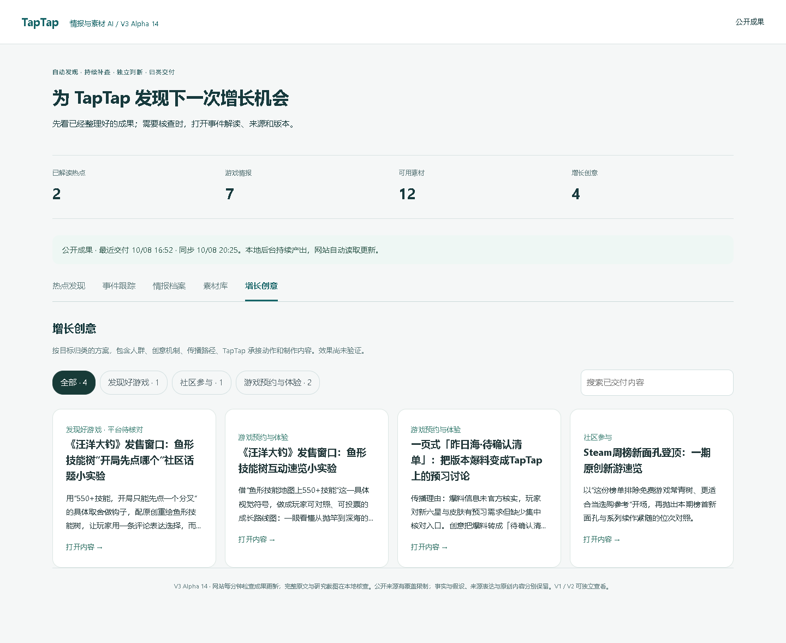
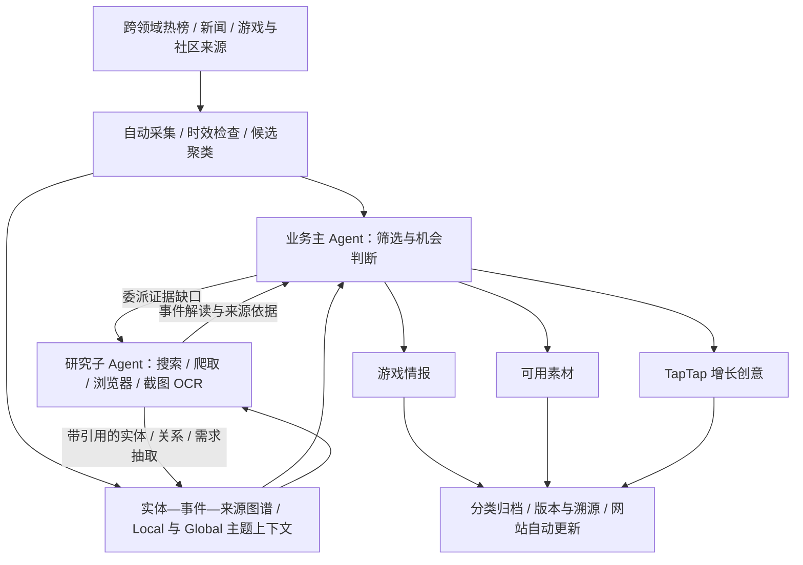
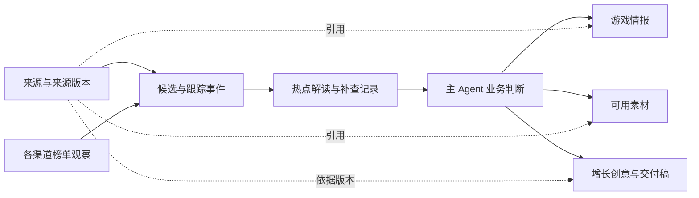
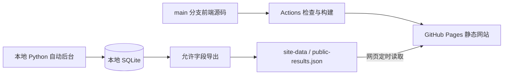

# TapTap 热点情报与素材系统

**持续追踪全网热点，自动研究与积累游戏情报、可用素材，从中识别并产出 TapTap 增长创意的 AI Agent 系统。**

[](docs/版本记录.md)
[](https://github.com/hccccc01333/taptap-hotspot-intel/actions/workflows/ci.yml)
[](https://github.com/hccccc01333/taptap-hotspot-intel/actions/workflows/pages.yml)

[**打开在线网站 →**](https://hccccc01333.github.io/taptap-hotspot-intel/) · [版本记录](docs/版本记录.md) · [运行与部署](docs/V3-GitHub部署与成果同步.md)

这是一个面向 TapTap 内容与运营场景的个人 Agent 开发项目。系统先发现社会、娱乐、文化、生活方式和游戏领域的近期话题，再判断它们能否形成游戏情报、可用素材或 TapTap 增长机会。使用者打开网站查看已经归类的成果，需要核查时再回到解读和来源。素材和创意支持搜索、弹窗阅读、复制及下载 Markdown 稿件，使用边界与来源随稿保留。



<sub>2026-10-08 线上真实成果页。截图中的数量属于当时的运行快照，以网站最近同步时间为准。</sub>

初次了解项目，可以先看[交付内容](#系统交付什么)和[Agent 分工](#agent-如何工作)；想了解实现，可以继续看[技术栈](#实际技术栈)、[V3 数据链路](#v3-的数据如何变成成果)、[GraphRAG 的实现](#graphrag-思想在-v3-中怎么落地)和[LangGraph 的使用范围](#langgraph-在项目中怎么用)。启动步骤见[本地运行](#本地运行)。

## Alpha19：验证架构是否值得

新增独立的可复现实验工具，以普通LLM、同模型加搜索、真实完整Agent链路进行对照，核查事实、日期、引用、风险拒绝、必要信息覆盖和成本。实验预先冻结样本及核验基准，保留无效输出和失败，不使用运营人员或另一个模型的创意评分代替事实证据。

461项工程回归通过，真实付费对照仍等待额度授权；目前**没有架构优于基线的实验结论**。这批更新不增加生产Agent或人工启动按钮，也不修改后台的额度暂停。方法、预算和运行命令见[可复现对照实验](docs/V3-可复现对照实验.md)。

## Alpha18 更新

新增“主流供应商预设＋自定义接口”，本地运营账号从页头“模型设置”保存配置并选择使用。主 Agent 与研究子 Agent 共用所选配置，自动采集、研究与归类交付继续按原有计划运行。

| 更新 | 实际变化 |
| --- | --- |
| 13类供应商预设 | OpenAI、Claude、Gemini、Grok、DeepSeek、千问、GLM、Kimi、MiniMax、豆包、硅基流动、OpenRouter、Ollama |
| 自定义配置 | 可改基础地址、实际模型 ID、密钥环境变量名；同一家供应商可保存多份配置，不必改代码白名单 |
| 三种协议 | OpenAI Chat Completions、Responses 与 Anthropic Messages，分别处理请求参数、最终文本和用量 |
| 推理与输出预算 | 各家使用各自参数，思考开关、强度、思考 token 及结构化输出可配置；所有结果通过同一套本地业务与证据校验 |
| 配置与运行保护 | 保存未启用配置不发起请求；运行中禁止改配置，旧配置交付被版本检查拒绝；既有额度暂停继续生效 |
| 验证 | 新增20项供应商测试，共444项后端回归；本地设置持久化、角色限制、键盘操作及390px布局使用隔离库验证 |

使用步骤、供应商地址表、参数差异和验证边界见[模型供应商与自定义配置](docs/V3-模型供应商与自定义配置.md)。本轮没有付费模型调用，不宣称13家都已用真实账户在线验收。

模型设置独立读取配置状态，不等待成果总览加载；后台采集时可以查看配置，保存和切换继续受运行租约保护。

## Alpha17 图谱更新

| 更新 | 实际变化 |
| --- | --- |
| 两个 Agent 共用的关系索引 | 用实体、事件、来源主张及玩家需求组织证据，主 Agent 和研究子 Agent 读取同一套上下文 |
| 事件身份与进展分开 | 同一次发生才合并；后续进展保留独立身份，并保存方向、引文及依据版本 |
| Local / Global 检索 | 分别读取事件附近的证据、跨事件主题和缓存摘要；主题分组不直接认定为热点 |
| 研究工具扩展 | 增加实体解析、邻域检索、关联事件、进展追踪和主题上下文五个只读图工具 |
| 自动运行与交付保护 | 图索引在后台更新，交付检查来源与图版本；暂时数据库锁定后调度继续重试 |
| 验证与恢复 | 424项后端回归、前端类型检查与构建、线上桌面／移动端阅读及独立备份恢复通过 |

本轮在模型额度暂停状态下使用隔离数据、模拟模型与已有真实来源验证，未调用付费模型。AI 抽取、关系判断、主题摘要和新增创意的真实质量，仍需在额度恢复后用近期跨平台样本评估。完整记录见[版本记录](docs/版本记录.md)。

## 系统交付什么

| 入口 | 你能看到的成果 |
| --- | --- |
| 热点发现 | 说明“谁发生了什么”的标题、一句话概括，以及有依据的热点解读 |
| 事件跟踪 | 背景、时间线、讨论焦点、质疑与后续进展；尚未确认的事项自动安排补查 |
| 情报档案 | 游戏变化、玩家需求、社区创作、市场动向与风险观察，说明为什么值得 TapTap 关注 |
| 素材库 | 可编辑的文案、脚本、表达模板和游戏改编，附使用场景、替换方法、来源及使用边界 |
| 增长创意 | 面向谁、用什么创意、怎样传播、如何承接到 TapTap、引导什么动作，以及制作和执行方案 |

热点可以来自游戏之外。情报与素材需要有具体游戏场景，或具备合理的游戏改编方式。**情报、素材和创意分别判断，允许某项没有产出**；不会为了填满页面，强行把每个热点改写成推广方案。

## Agent 如何工作

系统采用一个业务主 Agent 和一个所属研究子 Agent。主 Agent 负责筛选、委派、业务判断及交付；研究子 Agent 专门补齐事件内容，按缺口使用联网搜索、爬虫、浏览器读取、评论区滚动、截图与 OCR。

这里的 **Agent 是有目标、输入、工具和交付约束的 AI 执行角色**。主 Agent 与子 Agent 可以使用同一个模型，但任务和权限不同。把一次工作拆成筛选、解读、制作等多次模型调用，并不意味着每个步骤都要新建一个 Agent。

后台所说的“任务”是**系统自动产生、自动领取和自动恢复的工作项**。使用者不需要创建任务或点击启动；打开五个入口，读取已经整理的成果。Alpha16 强化了这套自动执行机制，具体实现和故障验收见[自动执行可靠性与统一契约](docs/V3-自动执行可靠性与统一契约.md)。

Alpha17 将实体、事件、来源主张及玩家需求整理成两个 Agent 共用的图谱索引。研究子 Agent 可定位关联与缺口，主 Agent 结合局部事件证据和跨事件主题判断三个独立成果。它借用 GraphRAG 思想，保留现有运行架构；详细数据结构、检索、社区摘要及验收边界见[实体事件图谱与 GraphRAG 检索](docs/V3-实体事件图谱与GraphRAG检索.md)。

| 谁负责 | 做什么 | 对应实现 |
| --- | --- | --- |
| 业务主 Agent | 筛选候选、提出研究问题；结合证据判断游戏情报、素材和增长机会；有机会时规划方案并制作文案、脚本 | [`main_agent.py`](agent_v3/main_agent.py)、[`native_growth.py`](agent_v3/native_growth.py) |
| 所属研究子 Agent | 根据委派的问题选择取证动作，补齐事件背景、时间线和有限评论样本，返回解读、引用与未确认事项 | [`research.py`](agent_v3/research.py)、[`research_child.py`](agent_v3/research_child.py) |
| 程序运行层 | 自动采集、定时调度、执行工具、限制预算、验证结果、保存版本、恢复任务、同步网站 | [`service.py`](agent_v3/service.py)、[`work.py`](agent_v3/work.py)、[`store.py`](agent_v3/store.py) |

AI 决定“值得关注什么、还缺什么、能做什么”；程序负责让这些决定在规定的范围内执行。例如，模型提出网页搜索，程序检查参数和剩余工具预算，再调用搜索工具，并把实际结果返回给模型。模型本身不会因为收到一个标题就自动拥有联网能力。



- **自动推进**：采集、初筛、深度研究和成果同步在后台运行；浏览页面不触发生产任务。
- **持续补查**：未确认事项进入持久队列，带证据解决、退避重试或等待新来源，再写回原事件。
- **区分时间与事件**：近期采集时间不等于事件发生时间；旧内容重新升温需要新的热度依据。同一事件与后续进展分别处理。
- **保留判断边界**：事实、引用、推测与原创改编分别记录。模型最终输出经过结构和来源校验，推理过程不作为业务成果。
- **控制传播风险**：负面、争议、风险未确认及中高风险事件不生成推广创意和传播素材；可保留中立风险情报。
- **理解 TapTap 场景**：覆盖移动端生态与 PC 业务，区分游戏实际平台、社区需求及尚待确认的承接资源。

## 实际技术栈

当前产品主链路位于 `agent_v3/`，由 **Python + SQLite 的持久任务编排**驱动。仓库同时保留旧版分析与巡检实现；下表注明使用范围，避免把历史组件理解成当前 V3 的必经环节。

| 技术 | 用通俗的话解释 | 项目中实际怎么用 |
| --- | --- | --- |
| Python | 执行后台工作的语言 | 采集、Agent 任务、证据处理、业务校验和自动调度 |
| SQLite | 保存在本机文件中的数据库，无需另开数据库服务器 | 保存来源、榜单观察、事件关系、解读、成果、待办、运行记录和设置；V3 运行库在 `data/v3/agent.sqlite3` |
| FastAPI + Uvicorn | 把后台能力提供成 HTTP 接口，并运行这个服务 | [`webapp/main.py`](webapp/main.py)启动服务；[`agent_v3/api.py`](agent_v3/api.py)提供 V3 查询及管理接口；服务启动时启动后台调度 |
| React + TypeScript + Vite | 分别负责网页组件、代码类型检查和开发／构建 | [`spatial/`](spatial/)中的五个成果入口、分类、搜索、详情弹窗、引用核查、复制与下载；前端负责阅读已有成果 |
| Requests + Beautiful Soup | 前者获取网页/API，后者从 HTML 中提取内容 | 公开来源采集、新闻正文与模型 HTTP 请求；按已接入平台处理，记录实际读取范围 |
| JSON Schema + `jsonschema` | 给 AI 的输出定义“表格格式”，再用程序检查它是否填写合格 | 约束字段、类别、引用编号、数组数量与文字长度；本地验证最终 JSON，失败时进行有限修正 |
| Playwright + Node.js | 用真实浏览器打开动态网页，并读取可见内容 | 研究工具调用隔离浏览器，读取正文、定位评论区、滚动和截图；不使用使用者的浏览器登录资料 |
| Windows OCR | 从截图中的文字区域识别文字 | 补充可见正文和已定位的评论卡片，保存截图、坐标与识别方式；识别结果需要核查 |
| Transformers + PyTorch + BGE 中文模型（可选） | 把文字转成数字向量，用相似度召回可能相关的事件 | [`semantic.py`](agent_v3/semantic.py)离线加载本地 `BAAI/bge-small-zh-v1.5` 权重，向量缓存到 SQLite；缺依赖或权重时退回字符重合召回 |
| NetworkX + SQLite 图索引 | 把有依据的关联组成关系网，找共同研究主题 | Alpha17 的 [`knowledge_graph.py`](agent_v3/knowledge_graph.py)保存实体、事件、主张和需求；[`graph_retrieval.py`](agent_v3/graph_retrieval.py)用 greedy modularity 找社区，提供有来源的局部／主题检索；社区大小不代表热度 |
| LangGraph（历史分析／巡检） | 把执行流程写成“节点、分支和循环”的图 | `L4_intelligence/`的旧版分析图与`runtime/`的巡检任务图，具体用法见下文；V3 业务编排使用自己的持久队列 |
| GitHub Actions + GitHub Pages | 前者自动检查和部署，后者托管静态网站 | 发布前端构建；独立数据分支提供整理后的公开成果，本地后台持续同步 |

模型接入位于 [`model.py`](agent_v3/model.py)：统一选择供应商，检查额度暂停和失败退避，再调用对应适配器。

| 已有适配器 | 调用方式 | 说明 |
| --- | --- | --- |
| [`providers.py`](agent_v3/providers.py) + [`provider_adapter.py`](agent_v3/provider_adapter.py) | 可配置的 Chat Completions、Responses 和 Claude Messages | Alpha18 的13类预设与自定义接口；配置持久化，密钥只引用环境变量，读取最终 JSON 并保留真实模型及用量 |
| [`deepseek.py`](agent_v3/deepseek.py) | 直接请求 DeepSeek 官方 Chat Completions API | 当前生产配置为 `deepseek-flash`；读取接口返回的实际模型名，支持推理强度和阶段输出预算 |
| [`opencode_zen.py`](agent_v3/opencode_zen.py) | 通过 OpenCode 的运行接口调用 Zen 模型 | 保留免费模型接入；免费额度耗尽或服务拒绝时保留任务并暂停，不能把“免费”理解成一直可用 |
| [`space_bunny.py`](agent_v3/space_bunny.py) | 直接请求 Space Bunny API | 独立供应商接入，与 OpenCode Zen 分开配置和记录 |

适配器存在表示代码支持该调用路径，实际能否运行取决于凭证、供应商服务和可用额度。系统不会在失败后悄悄切换到另一个付费模型。截图识别使用本地 OCR，当前并非调用多模态大模型识图。

## V3 的数据如何变成成果

### 1. 先保存来源，再判断是不是热点

[`connectors.py`](agent_v3/connectors.py)定义已接入的渠道，包括综合与游戏热榜、B 站热门及游戏榜、微博／贴吧话题、TapTap 发现页、游戏媒体和社会／文娱／生活新闻订阅。不同渠道可能出现访问失败；来源覆盖以实际采集结果为准。

采集到的每条内容先形成一条**来源证据**，主要保留来源编号、平台、标题、URL、已读正文或摘要、内容类型、发布日期与首次／最近观察时间。榜单名、位置和观察时间另存在 `channel_observation`，防止把不同榜单的数字混算。原始来源与整理后的热点解读分开保存。

**线索不等于热点。** 一条新闻刚发布、一个帖子位于发现页、一个搜索结果被找到，都不能单独证明它正广泛传播。热点展示还需要充分的当前解读及实际热榜依据。正文未取得时会标明“仅标题／摘要”等读取范围，不能冒充已经读过全文。

### 2. 区分候选分组、同一事件和后续进展

当前分组与关联分两层处理：

1. **候选分组**：[`discovery.py`](agent_v3/discovery.py)规范化标题的字符形式、大小写和空白，建立相同标题的候选桶。这是低成本发现入口，还不能证明它们描述同一事件。
2. **事件关联**：[`tracking.py`](agent_v3/tracking.py)建立稳定的跟踪事件；原始文档 URL 可辅助确认来源身份，语义或字符相似度只提出待判断关系。模型结合双方原文引用，区分“同一事件、后续进展、相关、不同、证据不足”。关系带来源版本、理由和历史记录，已确认关联可以撤回。

例如，“某游戏公布新版本”和“该版本上线后的玩家反馈”可以建立后续进展关联，但保留两个事件身份；不能因为都出现游戏名，就把它们当成同一条消息覆盖。来源发生变化时，旧版本的待判断关系会失效，后续读取需重新核对。

Alpha17 进一步建立增量实体—事件—主张—需求图谱。游戏别名使用共享注册表，歧义时不强连；未注册人物／活动按来源保留 proposed 身份。研究解读同次必须返回实体、关系和需求数组；缺乏依据时显式为空，引用约束抽取，模型建议再由研究核查。Local 检索对象及事件邻域，Global 返回有依据的主题与缓存摘要；后续进展保存关联边，**只有同一次发生才合并事件**。

这是 GraphRAG 思想的定制落地，**没有安装完整 Microsoft GraphRAG，也没有完整层级报告和 Global map-reduce 问答**。NetworkX 社区依据有效事件关联和有限样本需求，不能仅凭共享游戏／平台连接全部内容，更不能把事件数量当热点。源码、表结构、五个只读工具与离线评估见[详细说明](docs/V3-实体事件图谱与GraphRAG检索.md)。真实模型抽取准确率仍需额度恢复后验收。

时间也分开处理：`published_at` 是来源发布日期，观察时间是系统何时看到它，事件日期需从来源核对。当前关注窗口通常为过去168小时；旧内容若没有近期重新传播的证据，不会因今天再次采集就变成今天的热点。榜单位置变化与正文变化分别记录，普通排名波动不会反复触发整套内容分析。

### 3. 主 Agent 初筛，把研究预算用在值得看的线索上

主 Agent 先读取紧凑的候选包，判断五种情况：游戏直接相关、可迁移的通用表达、需要探索的跨领域联系、无关、信息不足。随后决定委派研究、直接分析、观察或归档。游戏渠道有候选保留位置，但渠道名不能代替游戏相关性判断。

初筛和深度处理分开排队。当前初筛每次最多两批、每批40条；深度周期最多选择两个业务话题，共享最多六次来源工具调用预算，最多制作一个创意任务。预算是上限，不要求每轮用满，也不表示周期内所有候选都已完成研究。实现见 [`main_agent.py`](agent_v3/main_agent.py)、[`service.py`](agent_v3/service.py)和[`pipeline.py`](agent_v3/pipeline.py)。

### 4. 研究子 Agent 按证据缺口取证

研究从主 Agent 给出的具体问题和检索词开始，例如“这是本周的新进展吗”“玩家争议具体指什么”“原始发布在哪里”。子 Agent 选择工具；程序检查并执行工具，再反馈实际结果，允许在预算内根据新结果调整下一轮动作。

| 工具名 | 做什么 | 读取边界 |
| --- | --- | --- |
| `read_detail` | 优先通过已有爬虫／正文连接器补读详情 | 只承诺已接入来源的实际读取范围 |
| `search_web` / `search_news` | 查找其他公开报道与背景，必要时尝试浏览器搜索 | 搜索摘要、已读正文分别标记；命中不等于同一事件或已确认事实 |
| `sample_discussion` | 读取平台支持的有限公开评论样本 | 保存日期、去重和样本质量标记；不能推断全体玩家态度 |
| `browse_page` | 打开动态页面，读取渲染后的正文 | HTTP 补读失败时可升级到浏览器读取；失败会保留缺口 |
| `screenshot_ocr` | 截取可访问页面并识别可见文字 | 只保存成功读取的证据；无识别内容的截图不作为有效成果 |
| `read_comments_visual` | 先定位评论区，再滚动、截图并读取评论卡片 | 只转录可靠卡片边界内的内容；找不到区域就不编造评论、作者或日期 |

子 Agent 还可以使用五个本地图谱工具查已积累的实体、关联事件和主题，具体见[图谱检索](#graphrag-思想在-v3-中怎么落地)。本地检索不消耗联网请求额度，调用次数仍受研究规划上限约束，调用也进入工具台账。

截图保留 URL、采集时间、文件哈希、画面位置和 OCR 元数据，以便本地对照原图。验证码、登录要求或访问拒绝会返回失败／受限状态；截图工具不能保证绕过这些限制。

子 Agent 的交付是**可读的热点解读**：标题、一句话摘要、背景、事件核心、时间线、实际讨论、争议、时间与风险判断、引用以及未确认事项。它不负责生成 TapTap 营销方案。关键缺口进入 [`followups.py`](agent_v3/followups.py)管理的补查队列；下一轮继续取证、有依据地回答，或退避等待新来源。“尚未确认”不是任务到此结束。

### 5. 主 Agent 分别交付情报、素材和创意

主 Agent 读取子 Agent 解读、实际来源、已有素材和 TapTap 业务条件，作出三个独立判断：

| 交付 | 需要回答的问题 | 最低内容要求 |
| --- | --- | --- |
| 游戏情报 | 发生了什么值得关注的变化，为什么与 TapTap／玩家有关？ | 具体变化、游戏或玩家场景、意义、事实依据、假设与下一观察条件 |
| 可用素材 | 编辑或制作人员拿到后，能具体用在哪里、怎样改？ | 可编辑正文／脚本／表达模板、游戏应用场景、用法示例、来源或原创标记、使用边界 |
| 增长创意 | 为什么现在值得做，怎样从这个热点引导用户到 TapTap？ | 目标人群、内容机制、传播位置、站内承接、用户动作、执行条件、文案／脚本及验证方式 |

提示词是代码中的版本化任务约束，主要位于 [`main_agent.py`](agent_v3/main_agent.py)、[`research_child.py`](agent_v3/research_child.py)和[`native_growth.py`](agent_v3/native_growth.py)。[`taptap_profile.py`](agent_v3/taptap_profile.py)提供带来源的产品背景：游戏发现、玩家社区、移动端基础和 PC 业务，同时限制未核实的功能、游戏上架、活动入口和资源承诺。团队实际业务条件来自运行设置，不能由模型自行编造。

素材需要交付可以复制编辑的内容，不能用“请生成一个视频”之类的提示词代替成品文本。来源原话、对表达方式的分析、原创游戏改编分别标记；链接、封面或原视频引用不会自动变成已授权素材。增长方案也不能把 PC 热点直接承接成某款手游下载，或承诺并不存在的奖励和入口。

举一个**流程示意，非真实采集成果**：若近期某款游戏更新后出现玩家共同关注的问题，系统可以保存更新及需求情报；如果有可复用表达，也可以保存原创对话稿；有明确内容切口和 TapTap 承接条件时，再制作社区内容方案。如果只有风险或争议，则保留中立情报，不制作推广创意或传播素材。这三种结果允许分别为空，创意也允许直接基于充分的热点证据形成。

### 6. 用结构与证据约束模型输出

[`task_packets.py`](agent_v3/task_packets.py)把来源整理成有大小上限的任务包，并从已读内容生成 `quote_candidates`。每个候选引用有一个整数 `ref`，绑定实际来源编号与逐字文本。模型选择 `fact_refs` / `basis_refs`，程序再还原引用，减少模型自行编造来源编号或“网友原话”的空间。

[`contracts.py`](agent_v3/contracts.py)是主、子 Agent 共用的交付入口：阶段对应执行角色，输入包带版本指纹，所有适配器返回相同的 `result` 和运行元数据，并接受同一套本地 Schema 与引用检查。DeepSeek、Space Bunny、OpenCode Zen 使用各自的传输接口；Alpha18 的 Chat、Responses 与 Claude 配置也进入同一契约。适配层只读取最终文本，隔离各家推理内容，交付记录包含实际返回的模型名与配置版本。换供应商不会换成另一套宽松的业务规则。

以当前 DeepSeek 接入为例，响应处理顺序为：

```text
HTTP 响应
  → 检查模型名称和 finish_reason
  → 只解析 choices[0].message.content 中的最终 JSON
  → JSON Schema 校验
  → 来源引用、时间、风险和业务条件校验
  → 保存通过校验的交付与依据版本
```

`content` 是最终回答字段。`reasoning_content` 属于推理内容，不作为交付解析或保存；记录可以包含结束原因、是否返回推理、token 用量等元数据。最终回答为空、截断或格式不合格时，不会拿推理文本填补业务结果。

DeepSeek 请求使用 JSON 输出模式，Schema 的具体约束由本地程序再验证，并非假定供应商已保证所有字段正确。格式失败最多再修正一次，仍失败则保存失败信息、已有用量与待办。`low` 为默认推理强度，单次请求的总输出上限默认16,384 token；各阶段按任务需求设置更小的预算，推理与最终输出共用预算。一轮 Agent 工作包含多次请求，整轮用量需逐次累计，不能把这个单次上限当成整轮费用上限。

[`risk.py`](agent_v3/risk.py)还会在生成和任务领取时执行风险约束：负面、混合争议、风险不明或中高风险事件不能制作推广创意和传播素材；中立风险情报可保留。**结构通过和引用存在，只能证明格式与来源对应，不能证明每个语义判断都准确。**

### 7. 自动执行、任务恢复与成果更新

[`service.py`](agent_v3/service.py)的调度线程每30秒检查一次到期任务。首次初始化后，默认采集间隔60分钟、初筛间隔1分钟、深度待办检查间隔3分钟；具体设置保存在数据库，重启保留既有偏好。这些是检查／调度间隔，任务仍可能排队、退避或超过间隔才能完成。

当前后台使用一个任务工作线程，配合数据库运行锁和任务租约，避免两个周期重复领取同一项工作。初筛与深度研究都到期时交替推进，防止耗时研究一直占住初筛队列。正常使用者只读五个成果入口，自动生产不依赖网页按钮或浏览请求。

Alpha16 的运行租约与工作项领取凭证分别带随机 token。模型和工具请求在数据库事务外执行；交付时再检查租约、话题、来源及业务条件版本，把成果与完成回执放在同一个短事务提交。进程崩溃前没有提交的成果回滚，已经提交的成果保留；失效执行者无法重新续租或覆盖新结果。自动补查可用新的领取凭证更新情报，并保留之前的回执和分析版本。

[`tool_executor.py`](agent_v3/tool_executor.py)统一执行研究与兼容路径的工具调用。它在联网前持久预留预算，完成后记录实际工具用量、来源、耗时与异常；不同执行器共用同一个运行预算，重新创建实例不能扩大上限。中断且实际用量未知时保守保留预算。工具次数、token 和金额是不同计量：当前来源工具不返回计费金额，金额字段为空并标明未报告，不把调用次数伪装成实际费用。本地运行详情可查看工具台账，公开成果只保留允许发布的业务内容。

| 运行机制 | 怎样处理 | 解决什么问题 |
| --- | --- | --- |
| 持久待办 | `work_item` 保存待处理、处理中、延期、完成及已被新版本替代的任务 | 后台重启后仍知道哪些工作没完成 |
| 幂等任务键 | 任务阶段、话题版本、提示词／业务条件版本共同确定任务身份 | 避免相同内容反复生产相同成果 |
| 租约与退避 | 处理中任务有租约，到期可恢复；来源或模型失败记录原因和下次尝试时间 | 防止中断后永远卡住，或失败时持续高频重试 |
| 供应商暂停 | 额度不足可保存明确暂停状态，重启和旧退避到期都不会自行解除 | 在等待额度期间保留 AI 待办，采集与已配置的成果同步继续 |
| 版本与当前窗口 | 保存来源、解读、业务判断和创意依据版本；过期交付退出现用列表，历史保留 | 新变化可以重新处理，核查旧创意时仍能看到生成时的依据 |

原始证据、事件解读、主 Agent 业务判断和对外成果是不同层的数据。比如内部 `topic_intelligence` 记录业务分析，并不代表已经生成了一条对外游戏情报；真正的游戏情报记录在 `game_signal`。因此候选数量、处理数量、情报数量和创意数量不能互相替代。

主要保存关系如下。图中箭头表示“关联／依据”，不表示三个交付库必须依次产生：



使用者看到创意后，可以回看对应事件解读、事实引用、来源链接，以及本地保存的读取范围和版本；公开网站只提供允许发布的精简溯源信息。

## GraphRAG 思想在 V3 中怎么落地

图谱在这里是一份有出处的关系索引。它把“某条报道里提到了某个游戏”“两个事件有后续进展关系”“几条来源体现了相似玩家需求”保存为可检索的结构，再把相关证据提供给两个 Agent。主 Agent 用这些上下文判断情报、素材和增长机会，研究子 Agent 用它们发现需要核查的关联与缺口。

### 三种图各自负责什么

| 名称 | 解决的问题 | 实际实现 |
| --- | --- | --- |
| 执行图 | 哪一步先执行，失败后走哪个分支？ | 历史 LangGraph 流程；V3 的自动业务链路由 SQLite 持久队列、租约及程序调度驱动 |
| 实体—事件知识图谱 | 哪个对象涉及哪个事件，关系由什么来源支持？ | `kg_*` SQLite 表；来源版本、实体别名、事件、主张、需求及引用 |
| 社区发现图 | 哪些独立事件可以组成一个值得研究的共同主题？ | NetworkX 加权图与 `greedy_modularity_communities`，发现主题时保留事件身份 |

这里的“社区”是算法得到的主题分组。仅共享游戏、平台或公司不会把全部内容连在一起；主题内事件多，也不能直接证明它正在爆火。热点展示继续检查实际热度证据与时效。

### 从原文到可检索结构

1. **索引来源版本**：正文、URL、发布日期共同确定来源版本。原文保留在证据库，图谱记录引用关系，避免每次将整个原文库塞进模型。
2. **链接已注册实体**：共享游戏知识注册表，标准全名与别名使用同一索引，最长匹配优先，英文别名检查词边界。像“方舟”“悟空”这种歧义简称需要语境；未知人物或活动先按来源保留候选身份。
3. **研究时结构化抽取**：子 Agent 在同一次解读中必须返回 `knowledge.entities`、`knowledge.relations`、`knowledge.needs` 三个数组，附证据编号；依据不足明确为空。程序检查引用、实体索引与关系类型。
4. **保留判断状态**：来源声称、模型建议、引文支持、有限样本推断及被反驳关系分别记录。引文支持说明来源能支持这个关系，仍需核对事实真伪；时间顺序不自动生成因果。
5. **增量更新与过期撤出**：来源或注册表改变时更新相关索引。来源失效后，读取先排除过期的事件／主题上下文；旧记录保留供核查，交付时再次检查依据版本。

实现分别位于 [`graph_entities.py`](agent_v3/graph_entities.py)、[`knowledge_graph.py`](agent_v3/knowledge_graph.py)和[`graph_ai.py`](agent_v3/graph_ai.py)。

### Local 与 Global 怎样进入 Agent 输入

| 检索方式 | 返回什么 | 使用范围与预算 |
| --- | --- | --- |
| Local：局部检索 | 当前实体或事件附近的主张、需求、进展、待核查关系及来源片段 | 默认最多6个事件、2跳、12条关系、8条来源；Agent 输入进一步缩到4个事件，每条来源正文最多900字符 |
| Global：主题检索 | 跨事件主题、成员事件、来源依据与已缓存研究摘要 | 默认最多4个主题，主 Agent 初筛使用最多2个；每轮最多为1个变化主题生成 AI 摘要 |

图检索补充的来源进入同一份证据包，明确标记尚待核查。主题摘要按成员和来源指纹缓存，来源或成员变化后旧摘要退出有效上下文。模型生成在事务外执行，保存前后检查来源、事件、图版本与主题指纹，失效结果不会覆盖当前交付。

研究子 Agent 通过统一 Tool Executor 使用以下工具，程序限制参数和范围，记录实际来源、耗时、结果与异常：

| 只读工具 | 用途 |
| --- | --- |
| `resolve_entity` | 找到注册对象，名称有歧义时返回候选及未消歧状态 |
| `get_entity_neighborhood` | 查询明确对象附近的事件与证据 |
| `find_related_events` | 查找有依据的关联事件 |
| `trace_event_development` | 读取后续进展、方向与引用 |
| `retrieve_community_context` | 读取跨事件主题及有效缓存摘要 |

检索实现见 [`graph_retrieval.py`](agent_v3/graph_retrieval.py)。本地事件详情可查看涉及对象、关联解读和证据，公开网站只展示允许发布的精简字段。当前实现借用 GraphRAG 的局部检索及社区摘要思想，尚未实现完整 Microsoft GraphRAG、层级社区报告或 Global map-reduce 问答；详细表结构和边界见[架构说明](docs/V3-实体事件图谱与GraphRAG检索.md)。

## LangGraph 在项目中怎么用

LangGraph 是控制执行流程的框架：用节点表达工作步骤，用边表达先后顺序，用条件边表达分支。它还提供保存图状态和暂停恢复等机制；这些能力需要应用实际配置，不能因为安装了依赖就认为全部已经启用。参见[官方概述](https://docs.langchain.com/oss/python/langgraph/overview)、[持久化说明](https://docs.langchain.com/oss/python/langgraph/persistence)与[中断恢复说明](https://docs.langchain.com/oss/python/langgraph/interrupts)。

本仓库有两处真实 `StateGraph` 实现，均属于保留的历史流程：

| 位置 | 图负责的工作 | 实际启用的机制 |
| --- | --- | --- |
| [`L4_intelligence/intelligence/graph/graph.py`](L4_intelligence/intelligence/graph/graph.py) | 旧版情报与创意分析流程 | `StateGraph(IntelligenceState)`、节点、条件分支、有限修订环、`compile()` / `invoke()`；当前该图未配置持久检查点 |
| [`runtime/agent_graph.py`](runtime/agent_graph.py) | 根据任务契约运行数据巡检、产出质检与后续工具 | `StateGraph(InspectState)`、契约生成节点、有限重试、SQLite 检查点、`thread_id`、可选 `interrupt()` 与 `Command(resume=True)` |

### 旧版分析图：用节点与条件边组织工作

L4 的图先读取证据、分析趋势和相关性；不值得继续的内容归档，其他内容进入受众分析。证据不足时走研究分支，再进行机会判断、策略、创意和评估；评估需要修正时进入有上限的修订循环，最后执行风险与审核状态处理。

| LangGraph 概念 | 本项目代码中的对应方式 | 可以怎样理解 |
| --- | --- | --- |
| `State` | `IntelligenceState` | 各步骤共享的执行数据；节点返回要更新的字段 |
| `add_node()` | 注册 `evidence`、`relevance`、`creative`、`evaluator` 等函数 | 给每个工作步骤起名字，绑定实际 Python 实现 |
| `add_edge()` | 例如 `evidence → trend_analyst → relevance` | 固定的先后顺序 |
| `add_conditional_edges()` | 相关性分支、证据不足分支、评估／修订分支 | 根据当前结果选择下一步 |
| `compile()` / `invoke()` | `build_langgraph()` 建图，`run()` 调用编译后的图 | 把流程定义变成可执行流程，再传入状态开始运行 |

这些节点是任务步骤，不是十几个独立 Agent。`engine='auto'` 在安装 LangGraph 时调用真图；未安装时，L4 使用共享节点与路由函数的标准库执行器，并记录 `engine='stdlib_fallback'`。显式选择 `langgraph` 但缺依赖时会报错。执行引擎与模型是否真正参与分别记录，规则结果不能冒充 AI 成果。

L4 末端的 `human_review` 当前设置 `approved` / `awaiting_review` 状态，未在这里实现持久化的 `interrupt()` 恢复；实际检查点与中断用法在下面的巡检图中。旧版审核流程与 V3 正常五个入口的全自动交付流程分别保留。

### 巡检图：LangGraph 管流转，harness 管一步如何执行

[`runtime/task_contracts.py`](runtime/task_contracts.py)定义任务的工具链、产出要求和失败策略。图按契约生成工具节点，每个节点交给 [`runtime/harness.py`](runtime/harness.py)执行参数、预算、幂等、产出检查与轨迹记录。这里的 harness 可以理解成“每一步执行时的约束与记录层”。

首个工具完成后进入质检：通过则继续后续工具；未通过最多再执行一次，仍失败则记录降级。`InspectState` 只保留运行编号、步骤结果、质检轮数等有限信息，程序拒绝原文类字段和过长字符串进入该状态。

巡检图用 `SqliteSaver` 保存图状态，默认文件为 `runtime/state/graph_checkpoints.sqlite3`。`thread_id` 标识同一次可恢复执行；开启人工闸门时，`interrupt()` 保存暂停点，随后通过相同线程的 `Command(resume=True)`继续。此处的检查点数据库，与 V3 的业务任务库不是同一个数据库，也不会自动替 V3 恢复业务任务。

在项目根目录，可以查看已有图结构和检查点状态：

```bash
# 巡检图的 SQLite 检查点需要额外的可选依赖
python -m pip install langgraph langgraph-checkpoint-sqlite

# 导出真实图结构；不执行采集和模型任务，但会初始化本地状态库
python runtime/agent_graph.py --task trend_intelligence --graph

# 查看已有检查点
python runtime/agent_graph.py --status
```

当前 V3 复用了部分旧版模型响应处理和数据工具代码，但业务自动调度、主／子 Agent 委派、补查和交付恢复由 `agent_v3/`自己的程序与 SQLite 队列实现。阅读 V3 架构时，应以这些模块为准。

## 在线网站与自动更新

[GitHub Pages 网站](https://hccccc01333.github.io/taptap-hotspot-intel/)展示真实 Agent 成果，无需登录。

| 更新内容 | 更新方式 |
| --- | --- |
| 页面与前端功能 | `main` 推送相关源码后，GitHub Actions 自动检查、构建并部署 |
| 情报、素材和创意 | 本地后台每五分钟检查成果变化，自动同步到独立的 `site-data` 分支 |
| 使用者看到的内容 | 网站每分钟读取最新成果；无新成果时，后台每小时同步运行心跳 |

**当前后台在本地电脑运行。** GitHub Pages 不执行 Python、采集或模型任务。电脑关闭后，网站保留最后一次成果；超过90分钟未同步时显示提示。常驻云端运行尚未部署。

公开页只发布整理后的交付、短引用和来源链接。完整原文、评论、截图、账号身份、SQLite、密钥及模型运行记录留在本地；本地工作台保留更完整的溯源能力。部署配置与失败重试见[说明文档](docs/V3-GitHub部署与成果同步.md)。

从部署结构看，代码发布与成果同步是两条通路：



本地开发时，React 网页通过 Vite 代理访问 FastAPI；公开网站则读取整理后的 JSON，不直接连本机数据库或请求本机采集任务。后端修改需更新并重启实际运行后台；仅推送 Python 源码不会让 GitHub Pages 开始执行这些代码。

## 本地运行

需要 Python 3.11+、Node.js 和 npm。完整截图 OCR 当前使用 Windows OCR；浏览器研究还需要 Playwright 及可用浏览器，详见[工具配置](docs/V3-研究工具与自动队列.md)。

基础 Python 依赖在 `requirements.txt`，前端依赖在 `spatial/package-lock.json`。Playwright 浏览器环境、Windows 中文 OCR 和可选 BGE 模型权重需另行准备：浏览器工具支持用 `V3_BROWSER_NODE`、`V3_PLAYWRIGHT_MODULE`、`V3_BROWSER_EXECUTABLE` 指定路径；离线召回需要本地 Transformers／PyTorch 环境和已缓存权重，代码不会自动联网下载模型。缺少这些可选能力时，应查看相应工具的受限状态，不能把启动网页当作全部研究能力已经就绪。

```bash
git clone https://github.com/hccccc01333/taptap-hotspot-intel.git
cd taptap-hotspot-intel
python -m pip install -r requirements.txt
cd spatial
npm ci
cd ..
```

在系统或用户环境变量中设置 `DEEPSEEK_API_KEY`，然后在项目根目录选择模型与预算：

```bash
python -c "from agent_v3.store import Store; s=Store(); s.set_model('deepseek-flash'); s.set_reasoning('low'); s.set_output(16384); s.close()"
python -m uvicorn webapp.main:app --host 127.0.0.1 --port 8202
```

另开终端，在 `spatial` 目录启动前端。以下为 PowerShell 命令：

```powershell
$env:VITE_DEV_API_TARGET = 'http://127.0.0.1:8202'
npm run dev -- --host 127.0.0.1 --port 5182 --strictPort
```

打开 `http://127.0.0.1:5182/`。本地开发账号为 `运营A` 或 `观察E`，密码 `demo`；它们用于本机开发，不应作为公网 API 的认证配置。后台启动后自动调度，既有启停偏好会保留。运行数据位于 `data/v3/`，不会提交到 GitHub。

以上是原有 DeepSeek 的启动方式。后台启动后，也可以通过 V3 页头“模型设置”选择13类供应商预设或自定义接口，保存模型、基础地址和密钥环境变量名，再选择“切换使用”；未启用配置的保存不发起请求。GitHub Pages 的公开页不提供后台配置入口。步骤及完整预设表见[配置文档](docs/V3-模型供应商与自定义配置.md)。

原有 DeepSeek 生产默认推理强度 `low`，单次总输出预算16,384 token，包含推理和最终输出；新配置独立设置参数，服务之间不能混用思考字段。DeepSeek 接入、响应字段隔离与实际模型名称见[模型文档](docs/V3-DeepSeek.md)。模型调用需要自己的可用额度。

如果既有数据库保存了“用户确认额度不足”的暂停，补上 API key 或重启不会解除暂停；需在确认额度恢复后由维护者明确解除。普通来源失败和服务限流则按已记录的退避策略处理。

## 当前验证与边界

Alpha19 加入独立的普通LLM / LLM＋搜索 / 完整Agent对照实验工具：同一初始线索、同一官方Flash配置，复用真实生产链路，预先冻结10例与核验基准，保存失败的最终回答、来源快照和费用记录。后台暂停保留，实验单独授权预算；公开网站仍是五个自动成果入口。当前已只读准备240条真实候选，**付费对照尚未执行，尚无优于普通LLM或搜索的实验结论**。方案、核验标准、费用限制与复现命令见[可复现对照实验](docs/V3-可复现对照实验.md)。

截至2026-10-09，V3 Alpha18 已通过444项后端回归，包含20项新增供应商测试及此前26项图谱与自动恢复测试；TypeScript 检查、前端生产构建、桌面／390px移动端浏览和独立备份恢复通过。已有真实采集、研究、游戏情报、可编辑素材和增长创意记录，版本和失败可追溯。

| 验证层次 | 已确认的结果 | 结论范围 |
| --- | --- | --- |
| 契约与恢复 | 模拟模型、隔离 SQLite 验证引用、租约、幂等、版本、图谱及工具边界，独立恢复历史数据和截图 | 验证执行机制；不能证明模型语义判断准确 |
| 模型配置与协议 | 13类预设执行同一 Main／Research 契约，三种协议只提取最终文本；配置保存、切换和角色限制通过 | 模拟响应验证适配；实际账户权限、网络和业务质量仍待有额度时验证 |
| 自动后台 | 本轮真实后台自动采集并建立图索引，额度暂停保留，模型调用次数为0 | 自动生产无需页面按钮；暂停期间不生成新的 AI 交付 |
| 公开阅读 | 五入口、来源核查、复制、Markdown下载及桌面／移动端布局通过 | 网页展示已发布成果；GitHub Pages 不运行后台 |
| 图检索小样本 | 4条合成事件及人工给定关系验证事件身份、主题与别名边界，可用本地 BGE 对照召回 | 检索使用额外结构化标注，不能据此宣称优于 BGE 或证明真实抽取质量 |

开发者可以用下列命令检查图谱行为和前端构建。这些命令不调用付费模型；图谱评估使用合成数据，依赖和本地权重缺失时会报告实际使用的路径。完整回归模块列表见 [CI 配置](.github/workflows/ci.yml)。

```powershell
python -X utf8 -m unittest agent_v3.tests.test_providers18 agent_v3.tests.test_graph17 agent_v3.tests.test_runtime16 -q
python -X utf8 scripts/evaluate_graph17.py
cd spatial
npx tsc --noEmit
npm run build
```

项目仍处于 **Alpha**：来源覆盖有限，反爬及评论读取可能失败；增量聚类、候选筛选效率、热点质量和创意适配仍需打磨。增长创意是附带依据和执行条件的可测试草案，**尚未验证实际增长效果**。截图 OCR 可能识别错误，不能把识别文本直接当作已核实事实。

## 代码与文档

| 位置 | 作用 |
| --- | --- |
| `agent_v3/` | 主 Agent、研究子 Agent、工具、持久任务、契约校验、业务库与自动调度 |
| `agent_v3/discovery.py`、`tracking.py`、`semantic.py` | 候选分组、稳定事件及关系、可选离线相似度召回 |
| `agent_v3/graph_entities.py`、`knowledge_graph.py` | 注册实体消歧、来源版本及增量实体—事件—主张—需求索引 |
| `agent_v3/graph_retrieval.py`、`graph_ai.py` | Local／Global检索、社区发现、带引用的抽取与摘要缓存 |
| `agent_v3/runtime_guard.py`、`contracts.py`、`tool_executor.py` | 租约及依据版本检查、统一主／子交付契约、工具执行与预算台账 |
| `agent_v3/providers.py`、`provider_adapter.py` | 供应商预设与自定义配置、三种协议、推理／输出参数及最终文本隔离 |
| `agent_v3/task_packets.py`、`freshness.py`、`risk.py` | 结构化输出与引用、时效和传播风险约束 |
| `agent_v3/work.py`、`followups.py`、`revisions.py` | 业务待办、证据补查、内容与观测版本 |
| `agent_v3/presentation.py`、`public_site.py` | 阅读视图与公开成果导出／同步 |
| `spatial/` | React + TypeScript 前端，默认 V3 工作台，保留 V1／V2 入口 |
| `webapp/` | FastAPI 服务与本地认证接口 |
| `L1_data_source/` | 采集器与来源适配 |
| `L4_intelligence/intelligence/graph/` | 保留的旧版 LangGraph 分析图与标准库执行器 |
| `runtime/agent_graph.py`、`harness.py`、`task_contracts.py` | 保留的契约驱动 LangGraph 巡检图及执行约束 |
| `scripts/` | 公开成果导出、版本快照等辅助工具 |
| `docs/` | 设计、实测、部署与版本记录 |

- [模型供应商与自定义配置](docs/V3-模型供应商与自定义配置.md)
- [可复现对照实验：LLM、搜索与完整Agent](docs/V3-可复现对照实验.md)
- [实体事件图谱与 GraphRAG 检索](docs/V3-实体事件图谱与GraphRAG检索.md)
- [自动执行可靠性与统一契约](docs/V3-自动执行可靠性与统一契约.md)
- [自动交付与补查闭环](docs/V3-自动交付与补查闭环.md)
- [热点解读与游戏交付契约](docs/V3-热点解读与游戏交付契约.md)
- [正负面热点与评论补采](docs/V3-正负面与评论补采.md)
- [主 Agent 与所属研究子 Agent](docs/V3-主Agent与研究子Agent.md)
- [GitHub 部署与成果同步](docs/V3-GitHub部署与成果同步.md)
- [版本记录与历史验收](docs/版本记录.md)

V1、V2 及 V3 历次改动保留在 Git 历史和版本文档中，历史验收结论以当时版本为准。
