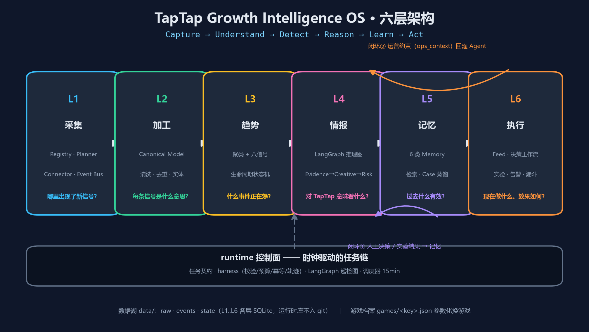
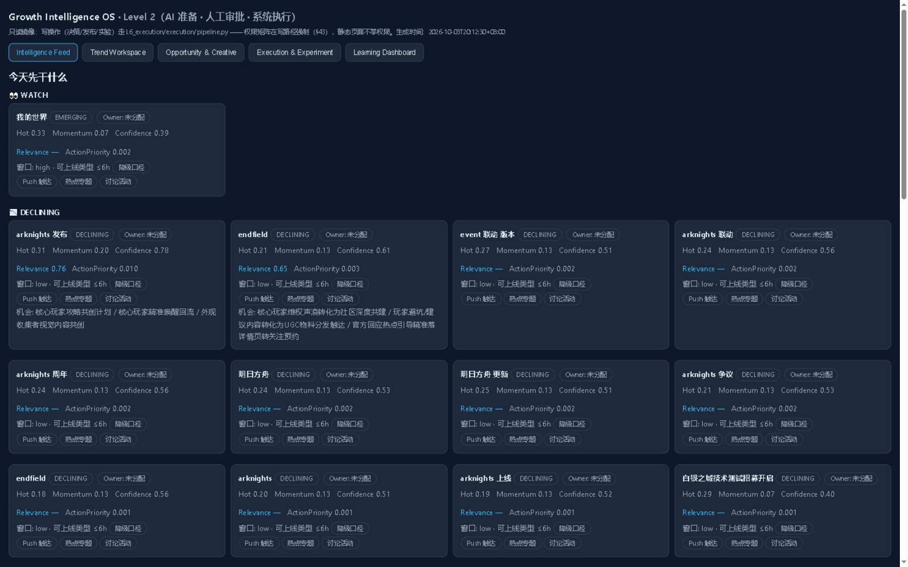
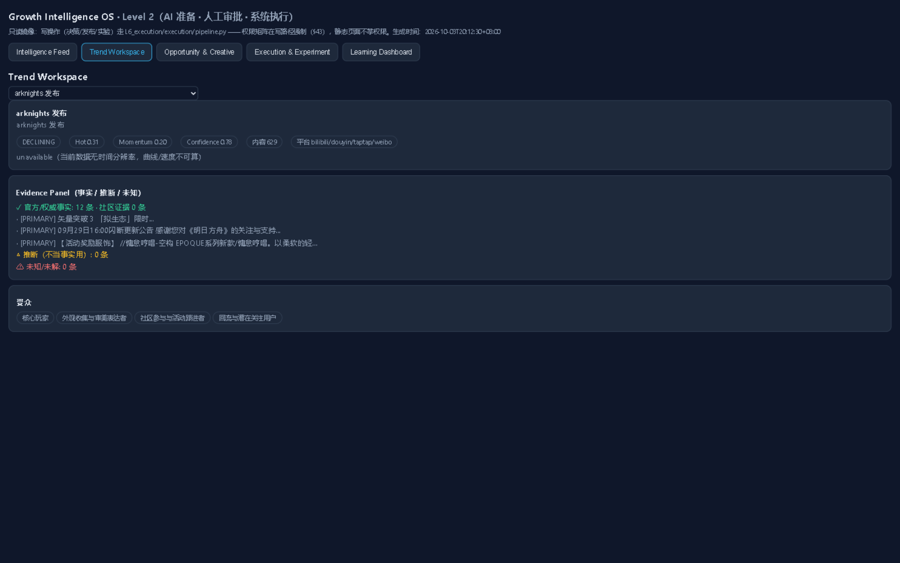
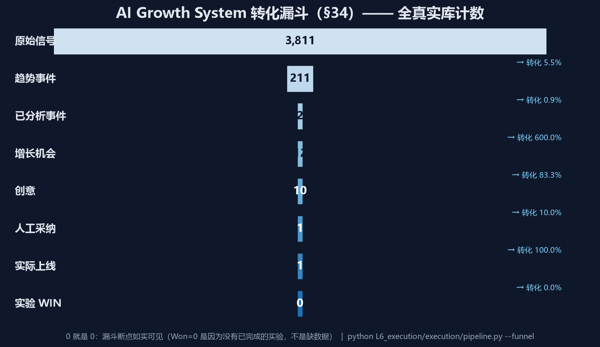
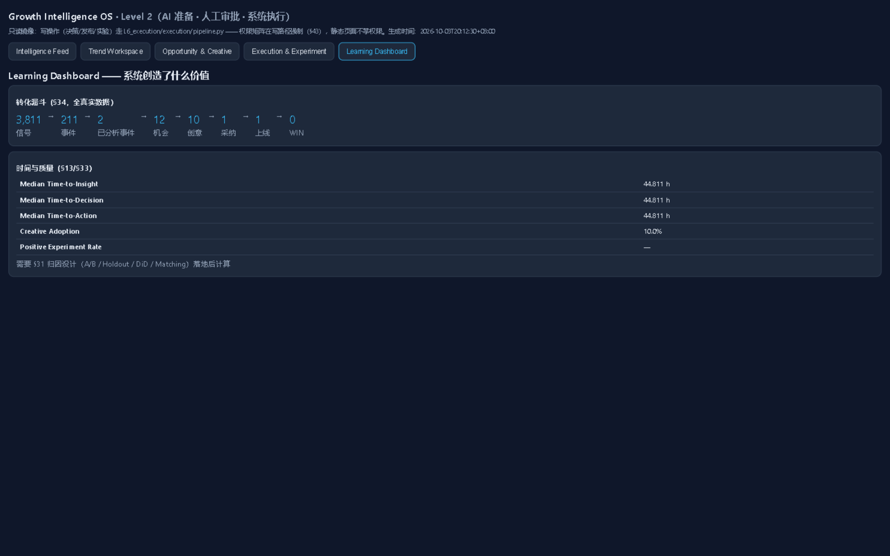
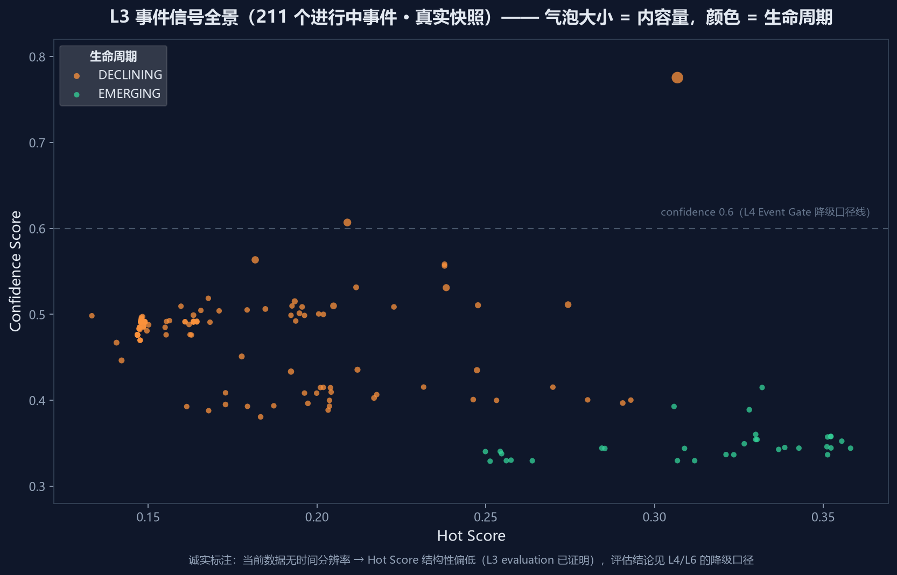

# 明日方舟 · TapTap Growth Intelligence OS


一套从互联网趋势发现，到 TapTap 增长机会判断、创意生产、**人工决策**、实验验证，再到经验学习的
**Growth Intelligence Operating System**。六个动词贯穿六层：

> **Capture → Understand → Detect → Reason → Learn → Act**

它衡量自己有没有价值，不看"AI 生成了多少报告"，只看三件事：
**比人工提前多久发现机会、从发现到上线缩短了多少时间、AI 驱动的实验创造了多少增量。**

---

## 系统架构



数据自上而下流过六层，两个闭环把系统变成生物体：
**人工决策与实验结果回写第五层记忆**（下一次 AI 更准），**运营约束回灌第四层 Agent**（不在真空里做增长策略）。
`runtime` 控制面用时钟驱动整条链：任务契约 + harness（校验/预算/幂等/轨迹）+ LangGraph 巡检图，15 分钟一轮。

## 系统在真实数据上的样子

### Intelligence Feed —— 运营每天打开的第一屏

不是"最热的 50 个事件"，而是"**最值得行动的**事件"：每张卡片带六维评分、
机会窗口（**还能追多久**直接决定可上线的创意类型）、AI 判断与机会摘要。



### Trend Workspace —— 可验证情报，不是"AI 说它在爆"

证据面板常驻：**事实 / 推断 / 未知** 三分展示（推断不当事实用），信源可信度、受众、时间线齐全。



### 转化漏斗 —— 0 就是 0

漏斗每一级都从五个真实库现算，断点如实可见。Won=0 是因为还没有已完成实验——失败和空白都是合法状态。



### Learning Dashboard —— 系统创造了什么价值

Median Time-to-Insight / Decision / Action、Creative Adoption、Positive Experiment Rate。
增量指标在归因设计（§31）落地前**如实显示 —**，绝不拍脑袋。



### L3 事件信号全景



---

## 六层总览

| 层 | 目录 | 回答的问题 | 关键能力 |
|---|---|---|---|
| **L1 采集** | `L1_data_source/` | 哪里出现了新信号？ | Source Registry / Crawl Planner / Connector Runtime / Snapshot / Event Bus，四通道爬虫 |
| **L2 加工** | `L2_signal/processing/` | 每条信号是什么意思？ | Canonical Model：清洗/去重/实体链接/分类/质量分，9 个子系统 |
| **L3 趋势** | `L3_trend/` | 什么事件正在爆？ | 在线聚类 + 八信号 + Hot/Momentum/Confidence + 生命周期状态机 + 父子事件 |
| **L4 情报** | `L4_intelligence/` | 对 TapTap 意味着什么？ | LangGraph 推理图：Evidence → Relevance → Opportunity → Creative → Evaluator → Risk，3 个 Gate + 有界修订环 + **人工闸门** |
| **L5 记忆** | `L5_memory/` | 过去什么有效？ | 6 类 Memory + 混合检索（六维评分/多样性/Case Package）+ Case 蒸馏 + Anti-pattern + Playbook 人工审批 |
| **L6 执行** | `L6_execution/` | 现在做什么、效果如何？ | Feed（ActionPriority+窗口约束）· 决策状态机 + Time-to-Action · 素材版本化 · 实验引擎（护栏/五态结果）· 告警 · 漏斗 · RBAC + 审计 |
| 控制面 | `runtime/` | 谁来驱动整条链？ | 任务契约（16 项 schema）+ harness + LangGraph 巡检图 + 调度器（探测 15min + 下游幂等跟随） |

## 快速开始

```bash
git clone https://github.com/hccccc01333/arknights-taptap-intel-agent.git
cd arknights-taptap-intel-agent
pip install -r requirements.txt        # langgraph 为可选依赖，未装时巡检图走 stdlib 等价执行器

# —— 手动跑一遍六层主链（无 LLM key 时规则兜底，产物如实标 mode）——
python L1_data_source/pipeline.py --once                          # ① 采集到期数据源
python L2_signal/processing/pipeline.py --run                     # ② 事件加工与标准化
python L3_trend/trend_engine/pipeline.py --run                    # ③ 聚类/评分/生命周期
python L4_intelligence/intelligence/pipeline.py --run --limit 5   # ④ 情报推理
python L5_memory/memory/pipeline.py --ingest-l3 --ingest-l4       # ⑤ 记忆回填（幂等）
python L6_execution/execution/pipeline.py --workbench             # ⑥ 离线工作台（双击即开）
```

### 决策与执行（第六层 · 全部带角色权限矩阵）

```bash
# 决策状态机：submit → approve（agent 角色永远无权审批/发布，§43 硬规则）
python L6_execution/execution/pipeline.py --decide creative idea_x submit  --actor 运营 --role operator
python L6_execution/execution/pipeline.py --decide creative idea_x approve --actor 评审 --role reviewer

# 素材 → 执行计划 → 上线（launch 只有 publisher 能按；Level 2：AI 准备 · 人工审批 · 系统执行）
python L6_execution/execution/pipeline.py --asset-gen idea_x
python L6_execution/execution/pipeline.py --plan idea_x --channels community_feed,push --experiment
python L6_execution/execution/pipeline.py --launch pln_x --actor 发布 --role publisher

# 实验：假设驱动 + 护栏（举报率击穿时主指标再显著也不判 WIN）
python L6_execution/execution/pipeline.py --observe-proportion exp_x ugc_rate primary 68 1000 42 1000
python L6_execution/execution/pipeline.py --finish exp_x --actor 评审 --role reviewer   # 结果回写第五层
```

### 自动化与观测

```bash
python runtime/scheduler.py --once --dry-run   # 看一轮将执行什么
python runtime/scheduler.py --status           # 采样健康度（频率校准依据）
python L6_execution/execution/pipeline.py --funnel    # 转化漏斗（全真实计数）
python L6_execution/execution/pipeline.py --value     # TTA / 采用率 / 实验胜率
python L5_memory/memory/pipeline.py --retrieve "明日方舟 联动 UGC"   # 混合检索
python L5_memory/memory/pipeline.py --evaluate        # Memory 利用率/新鲜度/接地率
python scripts/generate_assets.py              # 重新生成 README 可视化（读真实库）
```

## 核心纪律（这套系统的性格）

- **facts 锁数**：数字全部由代码计算，LLM 不生成任何数字；素材模板连"+320%"式的字面量都被测试禁止。
- **诚实降级**：跑不了就如实说——引擎标 `stdlib_fallback`、窗口标 `basis=degraded`、
  没数据的指标返回 `insufficient_data` 而不是 0。漏斗里 Won=0 就显示 0。
- **治理前置**：写入策略（LLM 推断永不自动进长期记忆）、PII 扫描（原始 id 一律拒绝）、
  RBAC（agent 拿不到审批/发布/急停）、审计带模型版本。
- **失败是合法结论**：实验五态 WIN / LOSS / INCONCLUSIVE / STOPPED / INVALID——
  护栏击穿时主指标 +62% 也判 INCONCLUSIVE（"CTR 再漂亮、举报率爆了不算成功"）。
- **每个实测踩坑都有测试钉死**：T0 门槛掐死整层、时区 naive/aware 相减、
  渲染分发缺挂载……全部先失败后修复再回归。

## 项目结构

```text
L1_data_source/   采集系统（registry/planner/connectors/adapters/bus/storage；四通道爬虫）
L2_signal/        数据加工与语义标准化（processing/：Canonical Model 9 子系统）
L3_semantic/      公告结构化（L1 internal connector 消费）
L3_trend/         趋势智能（trend_engine/ + intel_stats 统计底座）
L4_intelligence/  AI 情报与增长推理（LangGraph 编排；含 L5 记忆检索适配器）
L5_memory/        知识与增长记忆（6 类 Memory + 混合检索 + Case 蒸馏 + 治理）
L6_execution/     应用、决策与增长执行（含离线工作台，5 页面只读镜像）
runtime/          控制面（任务契约 + harness + LangGraph 巡检图 + 调度器）
games/            游戏档案（参数化入口：换档案即换游戏）
common/, paths.py 跨层工具与唯一路径出口
docs/             架构与各层设计文档（含 assets/ 可视化）
scripts/          资产生成 / 调度任务注册
data/             raw / events / state（运行时库不入 git）
```

## 测试

```bash
for d in L3_semantic L3_trend L4_intelligence L5_memory L6_execution runtime games; do
  python -m unittest discover -s $d/tests -p "test_*.py"
done
```

434 个用例，纯标准库可跑（langgraph 相关用例未安装时自动跳过，不假装跑过图）。

## 边界说明（不粉饰）

- 主数据面是 TapTap 切片；B站/抖音/微博为对照采集，不当作全网 KPI
- 当前 L3 历史数据无时间分辨率 → 小时级窗口/速度信号走降级口径（各产物如实标 `basis`）
- 价值看板的 Incremental 指标在 §31 归因（A/B / Holdout / DiD / Matching）落地前如实为 None
- 频率/阈值类未校准参数在契约与报告里逐处标注（已推导 / 未校准 / 待重建）

## 路线图

- [x] 六层架构落地 + 控制面重接线（旧舆情平台存量已移除，git 历史可回溯）
- [x] L4 真 LLM 推理 + L5 记忆闭环 + L6 决策/执行/实验全链
- [ ] 连续采集运行数周 → 校准频率/阈值，验证检测提前量与 Time-to-Action
- [ ] L6 通知渠道出网（飞书/Slack/企微）与真实发布渠道接入
- [ ] L6 归因设计落地 → Incremental 指标点亮
- [ ] L2 processing 子系统测试补齐

## 文档

架构与设计：[`docs/`](./docs/) · L4 详情：[`L4_intelligence/README.md`](./L4_intelligence/README.md) ·
L5 记忆层：[`L5_memory/README.md`](./L5_memory/README.md) · L6 执行层：[`L6_execution/README.md`](./L6_execution/README.md)

## 许可证

[MIT License](./LICENSE)
