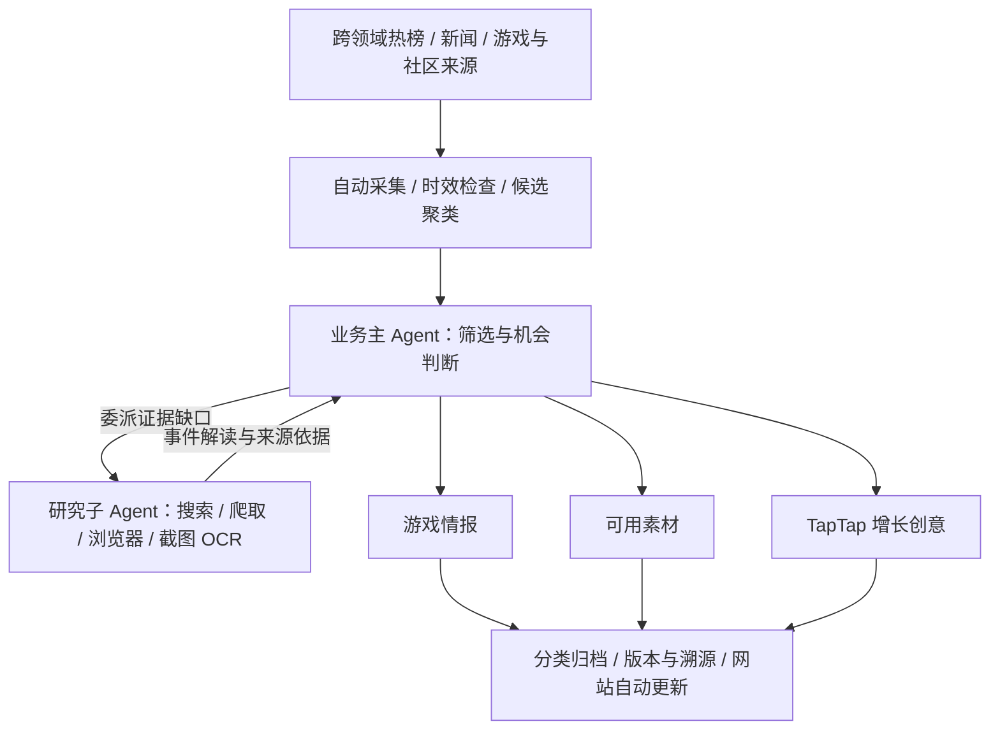
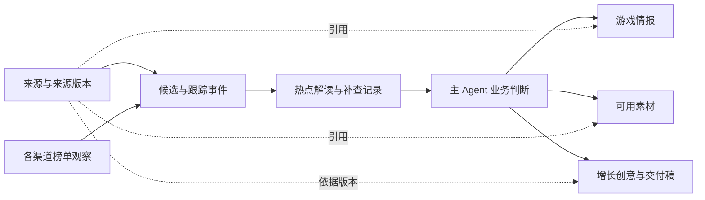
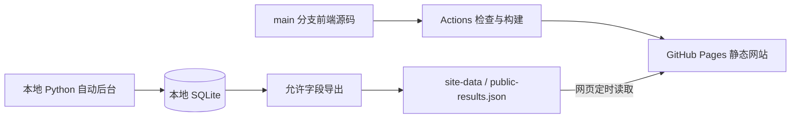

# TapTap 热点情报与素材系统

**持续从全网热点中，为 TapTap 找增长机会、提供情报、创意和可用素材的 AI Agent 系统。**

[](docs/版本记录.md)
[](https://github.com/hccccc01333/taptap-hotspot-intel/actions/workflows/ci.yml)
[](https://github.com/hccccc01333/taptap-hotspot-intel/actions/workflows/pages.yml)

[**打开在线网站 →**](https://hccccc01333.github.io/taptap-hotspot-intel/) · [版本记录](docs/版本记录.md) · [运行与部署](docs/V3-GitHub部署与成果同步.md)

这是一个面向 TapTap 内容与运营场景的个人 Agent 开发项目。系统先发现社会、娱乐、文化、生活方式和游戏领域的近期话题，再判断它们能否形成游戏情报、可用素材或 TapTap 增长机会。使用者打开网站查看已经归类的成果，需要核查时再回到解读和来源。素材和创意支持搜索、弹窗阅读、复制及下载 Markdown 稿件，使用边界与来源随稿保留。


<sub>2026-10-08 线上真实成果页。截图中的数量属于当时的运行快照，以网站最近同步时间为准。</sub>

初次了解项目，可以先看[交付内容](#系统交付什么)和[Agent 分工](#agent-如何工作)；想了解实现，可以继续看[技术栈](#实际技术栈)、[V3 数据链路](#v3-的数据如何变成成果)和[LangGraph 的使用范围](#langgraph-在项目中怎么用)。启动步骤见[本地运行](#本地运行)。

## 系统交付什么

| 入口 | 你能看到的成果 |
| --- | --- |
| 热点发现 | 说明“谁发生了什么”的标题、一句话概括，以及有依据的热点解读 |
| 事件跟踪 | 背景、时间线、讨论焦点、质疑与后续进展；尚未确认的事项自动安排补查 |
| 情报档案 | 游戏变化、玩家需求、社区创作、市场动向与风险观察，说明为什么值得 TapTap 关注 |
| 素材库 | 可编辑的文案、脚本、表达模板和游戏改编，附使用场景、替换方法、来源及使用边界 |
| 增长创意 | 面向谁、用什么创意、怎样传播、如何承接到 TapTap、引导什么动作，以及制作和执行方案 |

热点可以来自游戏之外。情报与素材需要有具体游戏场景，或具备合理的游戏改编方式。**情报、素材和创意分别判断，允许某项没有产出**；不会为了填满页面，强行把每个热点改写成推广方案。

## Agent 如何工作

系统采用一个业务主 Agent 和一个所属研究子 Agent。主 Agent 负责筛选、委派、业务判断及交付；研究子 Agent 专门补齐事件内容，按缺口使用联网搜索、爬虫、浏览器读取、评论区滚动、截图与 OCR。

这里的 **Agent 是有目标、输入、工具和交付约束的 AI 执行角色**。主 Agent 与子 Agent 可以使用同一个模型，但任务和权限不同。把一次工作拆成筛选、解读、制作等多次模型调用，并不意味着每个步骤都要新建一个 Agent。

| 谁负责 | 做什么 | 对应实现 |
| --- | --- | --- |
| 业务主 Agent | 筛选候选、提出研究问题；结合证据判断游戏情报、素材和增长机会；有机会时规划方案并制作文案、脚本 | [`main_agent.py`](agent_v3/main_agent.py)、[`native_growth.py`](agent_v3/native_growth.py) |
| 所属研究子 Agent | 根据委派的问题选择取证动作，补齐事件背景、时间线和有限评论样本，返回解读、引用与未确认事项 | [`research.py`](agent_v3/research.py)、[`research_child.py`](agent_v3/research_child.py) |
| 程序运行层 | 自动采集、定时调度、执行工具、限制预算、验证结果、保存版本、恢复任务、同步网站 | [`service.py`](agent_v3/service.py)、[`work.py`](agent_v3/work.py)、[`store.py`](agent_v3/store.py) |

AI 决定“值得关注什么、还缺什么、能做什么”；程序负责让这些决定在规定的范围内执行。例如，模型提出网页搜索，程序检查参数和剩余工具预算，再调用搜索工具，并把实际结果返回给模型。模型本身不会因为收到一个标题就自动拥有联网能力。



- **自动推进**：采集、初筛、深度研究和成果同步在后台运行；浏览页面不触发生产任务。
- **持续补查**：未确认事项进入持久队列，带证据解决、退避重试或等待新来源，再写回原事件。
- **区分时间与事件**：近期采集时间不等于事件发生时间；旧内容重新升温需要新的热度依据。同一事件与后续进展分别处理。
- **保留判断边界**：事实、引用、推测与原创改编分别记录。模型最终输出经过结构和来源校验，推理过程不作为业务成果。
- **控制传播风险**：负面、争议、风险未确认及中高风险事件不生成推广创意和传播素材；可保留中立风险情报。
- **理解 TapTap 场景**：覆盖移动端生态与 PC 业务，区分游戏实际平台、社区需求及尚待确认的承接资源。

## 实际技术栈

当前产品主链路位于 `agent_v3/`，由 **Python + SQLite 的持久任务编排**驱动。仓库同时保留旧版分析与巡检实现；下表注明使用范围，避免把历史组件理解成当前 V3 的必经环节。

| 技术 | 用通俗的话解释 | 项目中实际怎么用 |
| --- | --- | --- |
| Python | 执行后台工作的语言 | 采集、Agent 任务、证据处理、业务校验和自动调度 |
| SQLite | 保存在本机文件中的数据库，无需另开数据库服务器 | 保存来源、榜单观察、事件关系、解读、成果、待办、运行记录和设置；V3 运行库在 `data/v3/agent.sqlite3` |
| FastAPI + Uvicorn | 把后台能力提供成 HTTP 接口，并运行这个服务 | [`webapp/main.py`](webapp/main.py)启动服务；[`agent_v3/api.py`](agent_v3/api.py)提供 V3 查询及管理接口；服务启动时启动后台调度 |
| React + TypeScript + Vite | 分别负责网页组件、代码类型检查和开发／构建 | [`spatial/`](spatial/)中的五个成果入口、分类、搜索、详情弹窗、引用核查、复制与下载；前端负责阅读已有成果 |
| Requests + Beautiful Soup | 前者获取网页/API，后者从 HTML 中提取内容 | 公开来源采集、新闻正文与模型 HTTP 请求；按已接入平台处理，记录实际读取范围 |
| JSON Schema + `jsonschema` | 给 AI 的输出定义“表格格式”，再用程序检查它是否填写合格 | 约束字段、类别、引用编号、数组数量与文字长度；本地验证最终 JSON，失败时进行有限修正 |
| Playwright + Node.js | 用真实浏览器打开动态网页，并读取可见内容 | 研究工具调用隔离浏览器，读取正文、定位评论区、滚动和截图；不使用使用者的浏览器登录资料 |
| Windows OCR | 从截图中的文字区域识别文字 | 补充可见正文和已定位的评论卡片，保存截图、坐标与识别方式；识别结果需要核查 |
| Transformers + PyTorch + BGE 中文模型（可选） | 把文字转成数字向量，用相似度召回可能相关的事件 | [`semantic.py`](agent_v3/semantic.py)离线加载本地 `BAAI/bge-small-zh-v1.5` 权重，向量缓存到 SQLite；缺依赖或权重时退回字符重合召回 |
| LangGraph（历史分析／巡检） | 把执行流程写成“节点、分支和循环”的图 | `L4_intelligence/`的旧版分析图与`runtime/`的巡检任务图，具体用法见下文；V3 业务编排使用自己的持久队列 |
| GitHub Actions + GitHub Pages | 前者自动检查和部署，后者托管静态网站 | 发布前端构建；独立数据分支提供整理后的公开成果，本地后台持续同步 |

模型接入位于 [`model.py`](agent_v3/model.py)：统一选择供应商，检查额度暂停和失败退避，再调用对应适配器。

| 已有适配器 | 调用方式 | 说明 |
| --- | --- | --- |
| [`deepseek.py`](agent_v3/deepseek.py) | 直接请求 DeepSeek 官方 Chat Completions API | 当前生产配置为 `deepseek-flash`；读取接口返回的实际模型名，支持推理强度和阶段输出预算 |
| [`opencode_zen.py`](agent_v3/opencode_zen.py) | 通过 OpenCode 的运行接口调用 Zen 模型 | 保留免费模型接入；免费额度耗尽或服务拒绝时保留任务并暂停，不能把“免费”理解成一直可用 |
| [`space_bunny.py`](agent_v3/space_bunny.py) | 直接请求 Space Bunny API | 独立供应商接入，与 OpenCode Zen 分开配置和记录 |

适配器存在表示代码支持该调用路径，实际能否运行取决于凭证、供应商服务和可用额度。系统不会在失败后悄悄切换到另一个付费模型。截图识别使用本地 OCR，当前并非调用多模态大模型识图。

## V3 的数据如何变成成果

### 1. 先保存来源，再判断是不是热点

[`connectors.py`](agent_v3/connectors.py)定义已接入的渠道，包括综合与游戏热榜、B 站热门及游戏榜、微博／贴吧话题、TapTap 发现页、游戏媒体和社会／文娱／生活新闻订阅。不同渠道可能出现访问失败；来源覆盖以实际采集结果为准。

采集到的每条内容先形成一条**来源证据**，主要保留来源编号、平台、标题、URL、已读正文或摘要、内容类型、发布日期与首次／最近观察时间。榜单名、位置和观察时间另存在 `channel_observation`，防止把不同榜单的数字混算。原始来源与整理后的热点解读分开保存。

**线索不等于热点。** 一条新闻刚发布、一个帖子位于发现页、一个搜索结果被找到，都不能单独证明它正广泛传播。热点展示还需要充分的当前解读及实际热榜依据。正文未取得时会标明“仅标题／摘要”等读取范围，不能冒充已经读过全文。

### 2. 区分候选分组、同一事件和后续进展

当前分组与关联分两层处理：

1. **候选分组**：[`discovery.py`](agent_v3/discovery.py)规范化标题的字符形式、大小写和空白，建立相同标题的候选桶。这是低成本发现入口，还不能证明它们描述同一事件。
2. **事件关联**：[`tracking.py`](agent_v3/tracking.py)建立稳定的跟踪事件；原始文档 URL 可辅助确认来源身份，语义或字符相似度只提出待判断关系。模型结合双方原文引用，区分“同一事件、后续进展、相关、不同、证据不足”。关系带来源版本、理由和历史记录，已确认关联可以撤回。

例如，“某游戏公布新版本”和“该版本上线后的玩家反馈”可能属于同一个事件的发展，但不能因为都出现游戏名，就把它们当成同一条消息覆盖。来源发生变化时，旧版本的待判断关系会失效，后续读取需重新核对。

这里借用了图式关联与可追溯摘要的思路，**当前没有接入完整 GraphRAG 框架，也没有完成实体知识图谱与社群报告体系**。已实现的是 SQLite 中的事件、来源和关系记录；向量用于召回，引用用于约束判断，二者都不能保证聚类语义一定正确。

时间也分开处理：`published_at` 是来源发布日期，观察时间是系统何时看到它，事件日期需从来源核对。当前关注窗口通常为过去168小时；旧内容若没有近期重新传播的证据，不会因今天再次采集就变成今天的热点。榜单位置变化与正文变化分别记录，普通排名波动不会反复触发整套内容分析。

### 3. 主 Agent 初筛，把研究预算用在值得看的线索上

主 Agent 先读取紧凑的候选包，判断五种情况：游戏直接相关、可迁移的通用表达、需要探索的跨领域联系、无关、信息不足。随后决定委派研究、直接分析、观察或归档。游戏渠道有候选保留位置，但渠道名不能代替游戏相关性判断。

初筛和深度处理分开排队。当前初筛每次最多两批、每批40条；深度周期最多选择两个业务话题，共享最多六次来源工具调用预算，最多制作一个创意任务。预算是上限，不要求每轮用满，也不表示周期内所有候选都已完成研究。实现见 [`main_agent.py`](agent_v3/main_agent.py)、[`service.py`](agent_v3/service.py)和[`pipeline.py`](agent_v3/pipeline.py)。

### 4. 研究子 Agent 按证据缺口取证

研究从主 Agent 给出的具体问题和检索词开始，例如“这是本周的新进展吗”“玩家争议具体指什么”“原始发布在哪里”。子 Agent 选择工具；程序检查并执行工具，再反馈实际结果，允许在预算内根据新结果调整下一轮动作。

| 工具名 | 做什么 | 读取边界 |
| --- | --- | --- |
| `read_detail` | 优先通过已有爬虫／正文连接器补读详情 | 只承诺已接入来源的实际读取范围 |
| `search_web` / `search_news` | 查找其他公开报道与背景，必要时尝试浏览器搜索 | 搜索摘要、已读正文分别标记；命中不等于同一事件或已确认事实 |
| `sample_discussion` | 读取平台支持的有限公开评论样本 | 保存日期、去重和样本质量标记；不能推断全体玩家态度 |
| `browse_page` | 打开动态页面，读取渲染后的正文 | HTTP 补读失败时可升级到浏览器读取；失败会保留缺口 |
| `screenshot_ocr` | 截取可访问页面并识别可见文字 | 只保存成功读取的证据；无识别内容的截图不作为有效成果 |
| `read_comments_visual` | 先定位评论区，再滚动、截图并读取评论卡片 | 只转录可靠卡片边界内的内容；找不到区域就不编造评论、作者或日期 |

截图保留 URL、采集时间、文件哈希、画面位置和 OCR 元数据，以便本地对照原图。验证码、登录要求或访问拒绝会返回失败／受限状态；截图工具不能保证绕过这些限制。

子 Agent 的交付是**可读的热点解读**：标题、一句话摘要、背景、事件核心、时间线、实际讨论、争议、时间与风险判断、引用以及未确认事项。它不负责生成 TapTap 营销方案。关键缺口进入 [`followups.py`](agent_v3/followups.py)管理的补查队列；下一轮继续取证、有依据地回答，或退避等待新来源。“尚未确认”不是任务到此结束。

### 5. 主 Agent 分别交付情报、素材和创意

主 Agent 读取子 Agent 解读、实际来源、已有素材和 TapTap 业务条件，作出三个独立判断：

| 交付 | 需要回答的问题 | 最低内容要求 |
| --- | --- | --- |
| 游戏情报 | 发生了什么值得关注的变化，为什么与 TapTap／玩家有关？ | 具体变化、游戏或玩家场景、意义、事实依据、假设与下一观察条件 |
| 可用素材 | 编辑或制作人员拿到后，能具体用在哪里、怎样改？ | 可编辑正文／脚本／表达模板、游戏应用场景、用法示例、来源或原创标记、使用边界 |
| 增长创意 | 为什么现在值得做，怎样从这个热点引导用户到 TapTap？ | 目标人群、内容机制、传播位置、站内承接、用户动作、执行条件、文案／脚本及验证方式 |

提示词是代码中的版本化任务约束，主要位于 [`main_agent.py`](agent_v3/main_agent.py)、[`research_child.py`](agent_v3/research_child.py)和[`native_growth.py`](agent_v3/native_growth.py)。[`taptap_profile.py`](agent_v3/taptap_profile.py)提供带来源的产品背景：游戏发现、玩家社区、移动端基础和 PC 业务，同时限制未核实的功能、游戏上架、活动入口和资源承诺。团队实际业务条件来自运行设置，不能由模型自行编造。

素材需要交付可以复制编辑的内容，不能用“请生成一个视频”之类的提示词代替成品文本。来源原话、对表达方式的分析、原创游戏改编分别标记；链接、封面或原视频引用不会自动变成已授权素材。增长方案也不能把 PC 热点直接承接成某款手游下载，或承诺并不存在的奖励和入口。

举一个**流程示意，非真实采集成果**：若近期某款游戏更新后出现玩家共同关注的问题，系统可以保存更新及需求情报；如果有可复用表达，也可以保存原创对话稿；有明确内容切口和 TapTap 承接条件时，再制作社区内容方案。如果只有风险或争议，则保留中立情报，不制作推广创意或传播素材。这三种结果允许分别为空，创意也允许直接基于充分的热点证据形成。

### 6. 用结构与证据约束模型输出

[`task_packets.py`](agent_v3/task_packets.py)把来源整理成有大小上限的任务包，并从已读内容生成 `quote_candidates`。每个候选引用有一个整数 `ref`，绑定实际来源编号与逐字文本。模型选择 `fact_refs` / `basis_refs`，程序再还原引用，减少模型自行编造来源编号或“网友原话”的空间。

以当前 DeepSeek 接入为例，响应处理顺序为：

```text
HTTP 响应
  → 检查模型名称和 finish_reason
  → 只解析 choices[0].message.content 中的最终 JSON
  → JSON Schema 校验
  → 来源引用、时间、风险和业务条件校验
  → 保存通过校验的交付与依据版本
```

`content` 是最终回答字段。`reasoning_content` 属于推理内容，不作为交付解析或保存；记录可以包含结束原因、是否返回推理、token 用量等元数据。最终回答为空、截断或格式不合格时，不会拿推理文本填补业务结果。

DeepSeek 请求使用 JSON 输出模式，Schema 的具体约束由本地程序再验证，并非假定供应商已保证所有字段正确。格式失败最多再修正一次，仍失败则保存失败信息、已有用量与待办。`low` 为默认推理强度，单次请求的总输出上限默认16,384 token；各阶段按任务需求设置更小的预算，推理与最终输出共用预算。一轮 Agent 工作包含多次请求，整轮用量需逐次累计，不能把这个单次上限当成整轮费用上限。

[`risk.py`](agent_v3/risk.py)还会在生成和任务领取时执行风险约束：负面、混合争议、风险不明或中高风险事件不能制作推广创意和传播素材；中立风险情报可保留。**结构通过和引用存在，只能证明格式与来源对应，不能证明每个语义判断都准确。**

### 7. 自动执行、任务恢复与成果更新

[`service.py`](agent_v3/service.py)的调度线程每30秒检查一次到期任务。首次初始化后，默认采集间隔60分钟、初筛间隔1分钟、深度待办检查间隔3分钟；具体设置保存在数据库，重启保留既有偏好。这些是检查／调度间隔，任务仍可能排队、退避或超过间隔才能完成。

当前后台使用一个任务工作线程，配合数据库运行锁和任务租约，避免两个周期重复领取同一项工作。初筛与深度研究都到期时交替推进，防止耗时研究一直占住初筛队列。正常使用者只读五个成果入口，自动生产不依赖网页按钮或浏览请求。

| 运行机制 | 怎样处理 | 解决什么问题 |
| --- | --- | --- |
| 持久待办 | `work_item` 保存待处理、处理中、延期、完成及已被新版本替代的任务 | 后台重启后仍知道哪些工作没完成 |
| 幂等任务键 | 任务阶段、话题版本、提示词／业务条件版本共同确定任务身份 | 避免相同内容反复生产相同成果 |
| 租约与退避 | 处理中任务有租约，到期可恢复；来源或模型失败记录原因和下次尝试时间 | 防止中断后永远卡住，或失败时持续高频重试 |
| 供应商暂停 | 额度不足可保存明确暂停状态，重启和旧退避到期都不会自行解除 | 在等待额度期间保留 AI 待办，采集与已配置的成果同步继续 |
| 版本与当前窗口 | 保存来源、解读、业务判断和创意依据版本；过期交付退出现用列表，历史保留 | 新变化可以重新处理，核查旧创意时仍能看到生成时的依据 |

原始证据、事件解读、主 Agent 业务判断和对外成果是不同层的数据。比如内部 `topic_intelligence` 记录业务分析，并不代表已经生成了一条对外游戏情报；真正的游戏情报记录在 `game_signal`。因此候选数量、处理数量、情报数量和创意数量不能互相替代。

主要保存关系如下。图中箭头表示“关联／依据”，不表示三个交付库必须依次产生：



使用者看到创意后，可以回看对应事件解读、事实引用、来源链接，以及本地保存的读取范围和版本；公开网站只提供允许发布的精简溯源信息。

## LangGraph 在项目中怎么用

LangGraph 是控制执行流程的框架：用节点表达工作步骤，用边表达先后顺序，用条件边表达分支。它还提供保存图状态和暂停恢复等机制；这些能力需要应用实际配置，不能因为安装了依赖就认为全部已经启用。参见[官方概述](https://docs.langchain.com/oss/python/langgraph/overview)、[持久化说明](https://docs.langchain.com/oss/python/langgraph/persistence)与[中断恢复说明](https://docs.langchain.com/oss/python/langgraph/interrupts)。

本仓库有两处真实 `StateGraph` 实现，均属于保留的历史流程：

| 位置 | 图负责的工作 | 实际启用的机制 |
| --- | --- | --- |
| [`L4_intelligence/intelligence/graph/graph.py`](L4_intelligence/intelligence/graph/graph.py) | 旧版情报与创意分析流程 | `StateGraph(IntelligenceState)`、节点、条件分支、有限修订环、`compile()` / `invoke()`；当前该图未配置持久检查点 |
| [`runtime/agent_graph.py`](runtime/agent_graph.py) | 根据任务契约运行数据巡检、产出质检与后续工具 | `StateGraph(InspectState)`、契约生成节点、有限重试、SQLite 检查点、`thread_id`、可选 `interrupt()` 与 `Command(resume=True)` |

### 旧版分析图：用节点与条件边组织工作

L4 的图先读取证据、分析趋势和相关性；不值得继续的内容归档，其他内容进入受众分析。证据不足时走研究分支，再进行机会判断、策略、创意和评估；评估需要修正时进入有上限的修订循环，最后执行风险与审核状态处理。

| LangGraph 概念 | 本项目代码中的对应方式 | 可以怎样理解 |
| --- | --- | --- |
| `State` | `IntelligenceState` | 各步骤共享的执行数据；节点返回要更新的字段 |
| `add_node()` | 注册 `evidence`、`relevance`、`creative`、`evaluator` 等函数 | 给每个工作步骤起名字，绑定实际 Python 实现 |
| `add_edge()` | 例如 `evidence → trend_analyst → relevance` | 固定的先后顺序 |
| `add_conditional_edges()` | 相关性分支、证据不足分支、评估／修订分支 | 根据当前结果选择下一步 |
| `compile()` / `invoke()` | `build_langgraph()` 建图，`run()` 调用编译后的图 | 把流程定义变成可执行流程，再传入状态开始运行 |

这些节点是任务步骤，不是十几个独立 Agent。`engine='auto'` 在安装 LangGraph 时调用真图；未安装时，L4 使用共享节点与路由函数的标准库执行器，并记录 `engine='stdlib_fallback'`。显式选择 `langgraph` 但缺依赖时会报错。执行引擎与模型是否真正参与分别记录，规则结果不能冒充 AI 成果。

L4 末端的 `human_review` 当前设置 `approved` / `awaiting_review` 状态，未在这里实现持久化的 `interrupt()` 恢复；实际检查点与中断用法在下面的巡检图中。旧版审核流程与 V3 正常五个入口的全自动交付流程分别保留。

### 巡检图：LangGraph 管流转，harness 管一步如何执行

[`runtime/task_contracts.py`](runtime/task_contracts.py)定义任务的工具链、产出要求和失败策略。图按契约生成工具节点，每个节点交给 [`runtime/harness.py`](runtime/harness.py)执行参数、预算、幂等、产出检查与轨迹记录。这里的 harness 可以理解成“每一步执行时的约束与记录层”。

首个工具完成后进入质检：通过则继续后续工具；未通过最多再执行一次，仍失败则记录降级。`InspectState` 只保留运行编号、步骤结果、质检轮数等有限信息，程序拒绝原文类字段和过长字符串进入该状态。

巡检图用 `SqliteSaver` 保存图状态，默认文件为 `runtime/state/graph_checkpoints.sqlite3`。`thread_id` 标识同一次可恢复执行；开启人工闸门时，`interrupt()` 保存暂停点，随后通过相同线程的 `Command(resume=True)`继续。此处的检查点数据库，与 V3 的业务任务库不是同一个数据库，也不会自动替 V3 恢复业务任务。

在项目根目录，可以查看已有图结构和检查点状态：

```bash
# 巡检图的 SQLite 检查点需要额外的可选依赖
python -m pip install langgraph langgraph-checkpoint-sqlite

# 导出真实图结构；不执行采集和模型任务，但会初始化本地状态库
python runtime/agent_graph.py --task trend_intelligence --graph

# 查看已有检查点
python runtime/agent_graph.py --status
```

当前 V3 复用了部分旧版模型响应处理和数据工具代码，但业务自动调度、主／子 Agent 委派、补查和交付恢复由 `agent_v3/`自己的程序与 SQLite 队列实现。阅读 V3 架构时，应以这些模块为准。

## 在线网站与自动更新

[GitHub Pages 网站](https://hccccc01333.github.io/taptap-hotspot-intel/)展示真实 Agent 成果，无需登录。

| 更新内容 | 更新方式 |
| --- | --- |
| 页面与前端功能 | `main` 推送相关源码后，GitHub Actions 自动检查、构建并部署 |
| 情报、素材和创意 | 本地后台每五分钟检查成果变化，自动同步到独立的 `site-data` 分支 |
| 使用者看到的内容 | 网站每分钟读取最新成果；无新成果时，后台每小时同步运行心跳 |

**当前后台在本地电脑运行。** GitHub Pages 不执行 Python、采集或模型任务。电脑关闭后，网站保留最后一次成果；超过90分钟未同步时显示提示。常驻云端运行尚未部署。

公开页只发布整理后的交付、短引用和来源链接。完整原文、评论、截图、账号身份、SQLite、密钥及模型运行记录留在本地；本地工作台保留更完整的溯源能力。部署配置与失败重试见[说明文档](docs/V3-GitHub部署与成果同步.md)。

从部署结构看，代码发布与成果同步是两条通路：



本地开发时，React 网页通过 Vite 代理访问 FastAPI；公开网站则读取整理后的 JSON，不直接连本机数据库或请求本机采集任务。后端修改需更新并重启实际运行后台；仅推送 Python 源码不会让 GitHub Pages 开始执行这些代码。

## 本地运行

需要 Python 3.11+、Node.js 和 npm。完整截图 OCR 当前使用 Windows OCR；浏览器研究还需要 Playwright 及可用浏览器，详见[工具配置](docs/V3-研究工具与自动队列.md)。

基础 Python 依赖在 `requirements.txt`，前端依赖在 `spatial/package-lock.json`。Playwright 浏览器环境、Windows 中文 OCR 和可选 BGE 模型权重需另行准备：浏览器工具支持用 `V3_BROWSER_NODE`、`V3_PLAYWRIGHT_MODULE`、`V3_BROWSER_EXECUTABLE` 指定路径；离线召回需要本地 Transformers／PyTorch 环境和已缓存权重，代码不会自动联网下载模型。缺少这些可选能力时，应查看相应工具的受限状态，不能把启动网页当作全部研究能力已经就绪。

```bash
git clone https://github.com/hccccc01333/taptap-hotspot-intel.git
cd taptap-hotspot-intel
python -m pip install -r requirements.txt
cd spatial
npm ci
cd ..
```

在系统或用户环境变量中设置 `DEEPSEEK_API_KEY`，然后在项目根目录选择模型与预算：

```bash
python -c "from agent_v3.store import Store; s=Store(); s.set_model('deepseek-flash'); s.set_reasoning('low'); s.set_output(16384); s.close()"
python -m uvicorn webapp.main:app --host 127.0.0.1 --port 8202
```

另开终端，在 `spatial` 目录启动前端。以下为 PowerShell 命令：

```powershell
$env:VITE_DEV_API_TARGET = 'http://127.0.0.1:8202'
npm run dev -- --host 127.0.0.1 --port 5182 --strictPort
```

打开 `http://127.0.0.1:5182/`。本地开发账号为 `运营A` 或 `观察E`，密码 `demo`；它们用于本机开发，不应作为公网 API 的认证配置。后台启动后自动调度，既有启停偏好会保留。运行数据位于 `data/v3/`，不会提交到 GitHub。

生产默认推理强度 `low`，单次总输出预算16,384 token，包含推理和最终输出。DeepSeek 接入、响应字段隔离与实际模型名称见[模型文档](docs/V3-DeepSeek.md)。模型调用需要自己的可用额度。

如果既有数据库保存了“用户确认额度不足”的暂停，补上 API key 或重启不会解除暂停；需在确认额度恢复后由维护者明确解除。普通来源失败和服务限流则按已记录的退避策略处理。

## 当前验证与边界

V3 Alpha 15 已通过372项后端回归、TypeScript 检查、前端生产构建及线上桌面／移动端浏览验收。已有真实采集、研究、游戏情报、可编辑素材和增长创意任务，版本和失败记录可追溯。测试验证机制和契约，不等同于已经验证分析准确率或创意效果。

项目仍处于 **Alpha**：来源覆盖有限，反爬及评论读取可能失败；增量聚类、候选筛选效率、热点质量和创意适配仍需打磨。增长创意是附带依据和执行条件的可测试草案，**尚未验证实际增长效果**。截图 OCR 可能识别错误，不能把识别文本直接当作已核实事实。

## 代码与文档

| 位置 | 作用 |
| --- | --- |
| `agent_v3/` | 主 Agent、研究子 Agent、工具、持久任务、契约校验、业务库与自动调度 |
| `agent_v3/discovery.py`、`tracking.py`、`semantic.py` | 候选分组、稳定事件及关系、可选离线相似度召回 |
| `agent_v3/task_packets.py`、`freshness.py`、`risk.py` | 结构化输出与引用、时效和传播风险约束 |
| `agent_v3/work.py`、`followups.py`、`revisions.py` | 业务待办、证据补查、内容与观测版本 |
| `agent_v3/presentation.py`、`public_site.py` | 阅读视图与公开成果导出／同步 |
| `spatial/` | React + TypeScript 前端，默认 V3 工作台，保留 V1／V2 入口 |
| `webapp/` | FastAPI 服务与本地认证接口 |
| `L1_data_source/` | 采集器与来源适配 |
| `L4_intelligence/intelligence/graph/` | 保留的旧版 LangGraph 分析图与标准库执行器 |
| `runtime/agent_graph.py`、`harness.py`、`task_contracts.py` | 保留的契约驱动 LangGraph 巡检图及执行约束 |
| `scripts/` | 公开成果导出、版本快照等辅助工具 |
| `docs/` | 设计、实测、部署与版本记录 |

- [自动交付与补查闭环](docs/V3-自动交付与补查闭环.md)
- [热点解读与游戏交付契约](docs/V3-热点解读与游戏交付契约.md)
- [正负面热点与评论补采](docs/V3-正负面与评论补采.md)
- [主 Agent 与所属研究子 Agent](docs/V3-主Agent与研究子Agent.md)
- [GitHub 部署与成果同步](docs/V3-GitHub部署与成果同步.md)
- [版本记录与历史验收](docs/版本记录.md)

V1、V2 及 V3 历次改动保留在 Git 历史和版本文档中，历史验收结论以当时版本为准。
