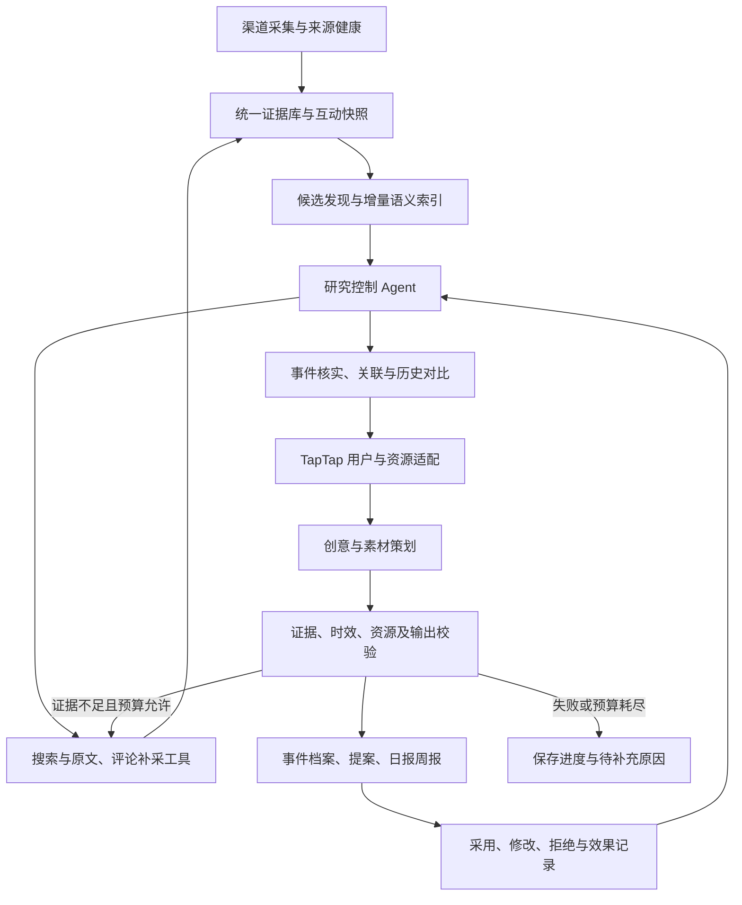

# TapTap 全网热点情报与增长创意 Agent · V2 设计

版本：设计 2.1，2026-10-07。目标来自用户提供的图片；V1 源码已保存为独立快照，原始数据保留原位。本文描述完整目标，实际交付状态另列，不能把设计条目当作已实现功能。

## 1. 从业务结果定义系统

用户目标原文：“全网热点追踪：构建 AI 自动化情报与素材系统，通过热点识别产出与 TapTap 相关的实际增长创意。”

系统的主要交付是可执行的 TapTap 增长创意及支持制作的素材。热点追踪负责发现机会，情报分析解释用户需求、传播吸引点和行动时机，素材系统组织可复用的内容与制作要点。事件档案和日报周报为这些交付提供依据与汇总。

“全网”要求面向不同渠道和领域发现热点，覆盖游戏、社会、娱乐、文化、生活方式等线索；实际渠道覆盖应如实声明。“与 TapTap 相关”由用户需求、产品价值和增长动作建立联系，不能只筛含 TapTap 或游戏名的内容，也不能限定为游戏社区运营。“实际增长创意”要求具体的人群、吸引点、传播与承接路径、用户动作、文案和素材，而非泛泛的“蹭热点”建议；可执行性是交付标准，已完成投放或测得增长效果是后续评估。

例如，假设某个生活方式话题出现了有依据的“碎片时间放松”需求，系统应先识别人群和表达方式，再判断 TapTap 能提供的价值，提出相应内容或活动创意与素材方案，并设计进入 TapTap 后的用户动作。这只是设计例子，不能写入真实热点库或当作实测交付。

主要使用者：TapTap 内容、社区与增长运营。暂按系统交付提案、运营核查后在业务平台执行的方式设计；业务资源、可用位置和核心指标可以配置，不假定系统拥有 TapTap 发布权限。

系统持续回答五个问题：

- 全网出现了什么新话题，哪些只是榜单或采样噪音？
- 哪些事件在变化，变化由什么证据支持？
- 这些事件与 TapTap 哪些用户、诉求和承接能力有关？
- 现在具体可以做什么，在哪里做，需要什么素材，能不能赶上？
- 已交付提案后来被采纳、修改或拒绝的原因是什么？

成功交付是一份运营能够判断和着手执行的增长创意包，包含情报依据、传播吸引点、用户动作和所需素材。页面数量、图节点数量、调用模型次数和单元测试数量均不等于业务成功。

## 2. 使用流程

默认入口是实时情报工作台，展示采集覆盖、候选线索、已研究事件及最近运行。用户可以设置关注目标，手动启动研究，也可以按配置让运行器定时处理新增线索。

用户打开一个事件时，先看到发生了什么、何时观察到、状态为何变化和支撑证据，再看到 TapTap 关联判断与创意。低置信度结论和待补采问题同时可见。

创意交付页包括目标人群、用户诉求、承接位置、用户动作、文案或内容提纲、执行步骤、素材来源、时间窗口、资源要求、风险与验证指标。可记录采用、调整或拒绝及原因，不把记录本身当作已完成投放或已产生增长。

日报汇总当天新增事件和已有事件的变化；周报基于持久保存的事件版本与反馈说明演变和价值。没有观察历史时明确说明无法比较，不能用当前快照制造七天曲线。

## 3. 全链路架构

调度器控制何时启动、任务互斥与预算；研究控制 Agent 根据证据决定查什么、是否继续、如何结束。确定性的计数、时间、约束与数据库写入由工具执行。模型负责理解和判断，不负责创造观测事实。

运行器首先完成可复查的单任务研究闭环，再扩展批量发现。不要把固定串行调用多个提示词包装成已经具备完整自主研究能力。

## 4. 采集和数据重新设计

采用连接器契约：发现、读原文、读评论、取互动快照，以及健康与限制声明。每个连接器只声明实际实现的能力。B 站、微博、贴吧、游戏媒体、TapTap 先按可获取的数据接入；不可用渠道显示缺口。

采集失败记录错误类型、重试时间、失败次数和最近成功水位。重试有上限；连续失败暂停该渠道，不能把整轮任务变成无声等待。读取历史 CSV 是 V1 到 V2 的迁移入口，不等于重新完成实时采集。

数据分为五类，语义各自明确：

- 原始内容：原始平台与内容标识、标题、正文或摘要、原文链接、发布时间、身份依据。
- 观察快照：本次观察时间与原平台指标；同内容、同观察不重复入库。
- 发现线索：榜单排名、搜索命中、推荐流命中及其渠道上下文。
- 研究判断：事件归属、主题、态度、诉求、事实、推断、未知与引用。
- 业务交付：创意、素材来源、使用条件、用户反馈和业务观察。

搜索发现同一视频不会增加独立内容数；不同平台热度不能直接相加；热搜词不是讨论量；采集时间不是发布时间；转载和评论不自动成为独立事件。

## 5. Agent 的工作与工具

研究控制 Agent 持有任务目标、当前档案、可用工具和剩余预算。每次产生一个明确的工具动作或结束判断，调用结果回到下一次决策。保存模型、工具、提示版本、输入引用、输出与结束原因。

首批工具：

- `list_candidates`：列出近期真实线索，附来源和时间，保留跨渠道候选。
- `search_evidence`：在统一库中查找相关内容。
- `read_evidence`：读取正文、来源和互动快照，原文必须真正进入模型上下文。
- `search_sources`：通过已接入的渠道补采，成功结果进入同一证据库。
- `list_events` / `read_event`：读取已有事件和研究版本，支持持续跟踪。
- `finish_research`：提交带引用的判断与创意，经过确定性验证再保存。

研究内可以依次使用不同角色的提示：发现研究员、事件分析员、TapTap 策略员、创意策划员和质检员。角色数量由任务需要决定，不以拆更多 Agent 为目标。单模型质检必须如实说明它不能提供独立模型评审。

没有模型、模型限流、结构化输出无效、查证失败和预算耗尽均有独立状态。规则只能提供召回线索与约束检查，不能顶替模型判断后仍显示研究成功。

## 6. 热点与事件跟踪

按「谁、发生什么、发生于何时、涉及谁」组织事件，中文标题是可修改描述，事件 ID 是稳定标识。优先更新已关联证据的事件；全新证据的语义归并由研究判断完成，需要保留合并依据。多事件引用同一证据时不能仅凭重叠自动归并。

候选发现保留新话题、互动异常、跨平台线索和已关注事件更新。全网候选进入研究前不设游戏关键词门槛；游戏词表仅用于一个专业领域的召回。非游戏热点按用户需求、文化表达、内容形式或可迁移参与方式寻找机会，并在后续关联判断中筛除缺乏 TapTap 价值的热点。

状态包括待查证、已确认、数据不足、升温、持续、降温和再活跃。升温等趋势状态必须引用不同时间的可比快照或发帖时间序列；只看一张榜单时不得给趋势结论。帖子旧但近期重新被发现，需要区分重新传播和真正新增内容。

语义抽取按内容版本增量处理并缓存；主题与原文一起保留，不只存游戏实体。大型图谱与 GraphRAG 在事件语义和查询需求验证后引入，不把图数据库作为首版必备条件。

## 7. TapTap 关联与创意

关联从用户和动作推导：话题涉及谁、这些人在意什么、为什么会来 TapTap、平台能提供什么内容或社区价值。直接涉及游戏仍可能没有行动价值；一般文化热点也可能有明确的游戏用户交集。

每条关联判断列出证据、推断、限制和不确定性。创意从可用资源与用户动作出发，不固定凑「专题、社区、Push」三条。资源不足、窗口已过或授权状态不清时，提案说明条件，或结束为暂不行动。

创意至少包含主题、关联理由、目标人群、位置、步骤、具体文案或提纲、素材清单、来源引用、时间与资源、风险和验证方案。模型不得编造 KPI 基线或增长承诺。

素材库应组织热点中的可复用表达、内容形式、叙事角度和视觉元素，并按创意形成标题、文案、脚本、视觉要点及制作清单；只保存新闻或帖子链接不足以实现素材系统。引用素材保留来源和使用状态；原创制作与来源素材分别记录。图像、视频与音频生成按明确的制作任务独立执行。来源链接、素材可用性和已获授权是不同字段。

## 8. 存储、服务和界面

V2 核心放在 `agent_v2/`，运行态独立放在 `data/v2/`。FastAPI 提供版本化接口 `/api/v2/`，React 提供 V2 入口；V1 保留可访问入口和源码快照。跨版本共享原始采集数据，V2 不覆写 V1 研究与行动记录。

首版使用 SQLite 保存证据、观察、来源状态、运行、工具轨迹、事件版本、创意和反馈。后台任务用受控工作线程执行，长任务立即返回运行 ID。每个线程创建自己的数据库连接。并发运行互斥，启动后可识别上次中断的任务。

界面按用户任务组织：运行与覆盖、候选线索、事件档案、创意与素材、交付与反馈。默认显示真实 API 数据，演示必须单独入口并标注。复杂动画不进入主工作路径。

## 9. 验收与升级顺序

P0：V1 快照、V2 契约、独立运行态、真实数据迁移、来源诊断与真实工作台。验收重跑不重复入库、时间口径正确、损坏源可见且不拖垮其他源。

P1：可执行研究 Agent、原文工具、补采、证据约束及事件保存。验收实际模型至少完成一次带工具轨迹的真实研究；模型失败明确保留失败状态。

P2：持续事件匹配、异常候选发现、语义索引与创意质量评估。建立经核查的真实标注样本，比较 V1 和 V2 的误合并、漏发现与关联误判；没有标注基线不报告准确率。

P3：素材交付、反馈、自动唤醒、日报周报与恢复。验收跨日事件版本能比较，提案能引用证据与素材，重复运行不重复交付，限流和重启不会制造成功结果。

每一阶段都区分设计完成、代码实现、模拟测试、真实数据验证和真实业务验证。只有前一阶段达到其可核查的标准，才扩展后续功能。

## 10. 当前状态

V1 已保存源码 ZIP 与 SHA-256 清单，原始数据留在原位置。接手诊断补丁已定位旧数据提示、经典页面启动中断及创意脚本与网页输出断点。

V2 已实现独立证据与正文版本库、六类实时采集连接器、受预算控制的工具研究运行器、事件和创意持久化、历史对比、运营反馈、行动简报、业务与模型配置，以及默认关闭的定时研究。默认 React 入口已切换到 V2，V1 保留单独入口。

53 项验证通过，真实六类渠道采集及桌面/手机界面已验证；真实模型研究交付尚未通过。免费服务出现限流、过载、空响应或超时，现有 DeepSeek 凭证实测返回 HTTP 402。增量语义索引、异常发现质量基准、跨日常驻验证、素材制作与复用体系以及创意业务可用性验证仍未完成。

目标纠偏已落实到默认研究任务、自动研究任务和模型指导：取消只看游戏媒体与 B 站、只面向社区玩家的默认限制，明确以增长创意和素材方案为终点。这些修改只纠正任务方向；目前 B 站默认榜单和百度实时榜单仍主要覆盖游戏领域，素材仍主要随创意保存，不能据此声称已实现全网发现或完整素材系统。

具体状态见 [V2-验收记录](V2-验收记录.md)。模型请求预算与响应处理参考 [OpenRouter 推理参数文档](https://openrouter.ai/docs/guides/best-practices/reasoning-tokens)，实际可用性以本机调用结果为准。不能把整个 V2 标为已完成。
