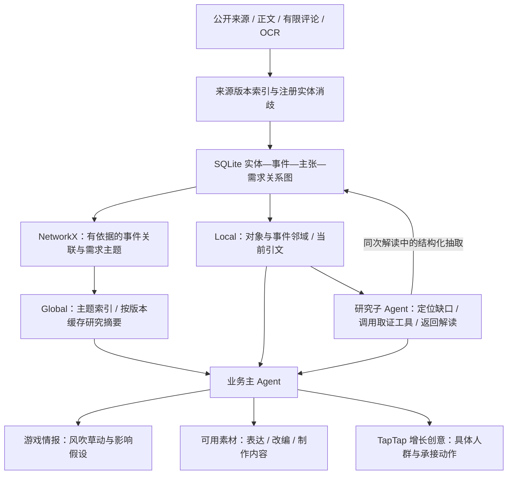

# V3 Alpha17：共享实体—事件图谱与 GraphRAG 思路

本版把“关键词相似就再检索一遍”升级为两个 Agent 共用、能追溯的关系索引。仍是一个业务主 Agent 和一个所属研究子 Agent，仍使用 SQLite，没有引入新的数据库服务或每功能一个 Agent。

这里借用 GraphRAG 的实体关联、局部检索、社区主题与摘要思路，**不是完整 Microsoft GraphRAG 实现**，也不是用关系图代替热点判断。首次落地侧重来源、版本、事件边界和有限检索；真实抽取质量还需额度恢复后检验。

## 先说明三个不同的“图”

| 名称 | 回答什么问题 | 本项目实现 |
| --- | --- | --- |
| LangGraph 执行图 | 下一步执行哪个步骤，失败后如何分支？ | 历史 L4 分析与 runtime 巡检；V3 使用自己的持久队列与租约 |
| 实体—事件知识图谱 | 哪个对象涉及哪个事件，哪条来源支持这条关系？ | 本版 `kg_*` SQLite 表与 `knowledge_graph.py` |
| 社区发现图 | 哪些独立事件可能共享一个值得研究的主题？ | NetworkX 加权无向图与 greedy modularity；不合并事件身份 |

“社区”指计算得到的主题分组，不代表 TapTap 里的论坛，也不等于正在爆火的人群。

## 自动运行链路



三个业务结果分别判断，可以为空。图谱是理解与检索底座，不是强制要求先有情报再有素材才能生成创意的流水线。

自动采集循环在筛选前更新索引，研究后再次更新；普通结果读取不启动研究。模型额度暂停时仍可建立字典实体、来源版本和已有解读主张的索引，**不会用字典补齐假 AI 解读**。AI 抽取、关系核查和研究摘要等待服务恢复。

## 存储的对象和证据

| 对象 | 核心字段 / 表 | 边界 |
| --- | --- | --- |
| 来源文档 | `kg_document`：来源编号、正文／URL／日期组合版本、索引器版本 | 原文仍在 evidence，不重复把所有原文塞进模型 |
| 实体及别名 | `kg_entity`、`kg_alias`、`kg_mention`：类型、原名、标准身份、语境、位置、引用 | 复用 L2 游戏注册表；公司开发／发行角色不制造两个公司身份 |
| 事件 | `kg_event`：稳定身份、话题版本、标题、解读状态、来源版本 | 同游戏不同活动仍是独立事件 |
| 事实主张 | `kg_claim`：主张文本、来源归属、引用、版本与运行编号 | “报道说了”不等于“独立证实了”；相反说法可同时保留 |
| 玩家需求 | `kg_need`：标签、具体推断、有限来源 | 需求是推断，不代表全体玩家；无充分内容不强行填需求 |
| TapTap 能力 | `kg_entity` 中 TapTapCapability，来自产品画像及其来源 | 平台有能力不能证明某款游戏已上架、已开活动或资源已获批 |
| 关系 | `kg_relation`：主体、关系、对象、状态、版本、时间、来源引文 | 不支持从时间顺序生成 CAUSED_BY 因果边 |
| 社区与摘要 | `kg_community`、`kg_community_summary`：成员、内容指纹、主题、引文、摘要版本 | 成员／来源变化使旧摘要不再被检索，历史保留 |

每条引用带 `evidence_id`、`source_version`、`content_hash`、URL、发布日期和逐字 quote。即使后台还没完成下一次重建，只要来源正文、URL 或日期变了，读取就先剔除过期依据及其事件／社区上下文。交付还检查图版本、检索事件版本、社区指纹和所有实际使用的来源。

关系状态不是装饰字段：

| 状态 | 含义 | 可怎样使用 |
| --- | --- | --- |
| source_attributed | 能归属到实际来源的提及或主张 | 保留引用，仍核对事实真伪 |
| proposed | 模型抽取的关系建议 | 供研究核查，不能当已确认关系 |
| source_supported | 通过当前引用核查的关系 | 可作检索关联，仍不保证报道本身真实 |
| inferred | 从有限来源提炼的需求等判断 | 明确标示假设，不外推总体 |
| contradicted | 实际来源反驳了关系建议 | 保留核查历史，不作为已支持关联 |
| legacy_unquoted / stale | 旧判断没有引文／来源或关系已失效 | 不进入有效事件关联及社区 |

## 实体消歧如何做

`graph_entities.py` 从已有游戏知识注册表生成别名多值索引，而不是让每个 Agent 自己发明一套游戏名称。最长名称优先匹配，英文别名检查词边界；多个标准对象共用别名时不随意选一个。

例如“方舟”缺少游戏语境时保留未消歧；明确提到“明日方舟／干员”等才可连接已注册游戏。“悟空”可能属于文娱内容，缺少“黑神话／游戏科学”等语境时不能强行归到游戏。`LOL` 也需要游戏语境，`lolcat` 不应命中。

研究子 Agent 在已有解读请求中，必须返回 `knowledge.entities / relations / needs`；无依据时显式为空，关系核查可用 `relation_reviews`，不额外增加一次实体抽取模型调用。每项都引用本次证据包的整数编号，本地程序检查引用、原名、实体数组索引和关系白名单。未注册人物、角色、活动、版本按来源生成 proposed 身份，不自动建立全局别名；标准名称必须保留原名，避免把评论里的玩笑作者认成真实人物。

这意味着首版会漏掉一些跨文档未注册实体。宁可留明确缺口，也不凭同名强合并。更完整的自动实体登记与跨文档消歧需要后续真实样本验收。

## 同一事件与后续进展

只有 `same` 才归并事件身份。`development` 保留两个独立事件，有明确方向时写 FOLLOWED_BY，方向未知用 DEVELOPMENT；主题相关用 RELATED_TO。引用必须支持双方内容，时间顺序不自动证明因果。

旧版 development 的合并效果在自动循环里按依赖逆序恢复，再按原顺序重放 same 判断；过程在保护事务中提交，保留来源、旧时间线、关系与恢复历史。没有旧合并效果的数据库只写迁移标记。本次实际运行库没有需要拆开的 development 合并，不会虚构迁移数量。

## Local / Global 检索和工具

Local 返回实体或事件附近的有效主张、需求、关联、待核查建议及原文片段。默认最多6事件、2跳、12关系、8来源，每个来源正文最多900字符；Agent 输入进一步缩到4事件。最多4个新增图检索来源进入证据包，并标 `graph_context_unverified`，重要事实仍需引文与事件归属核查。

Global 返回主题社区及缓存摘要。默认最多4主题，主 Agent 初筛只用2主题。它借用了社区摘要检索思想，**没有实现完整的层级社区报告与 Global map-reduce 汇总问答**。当前摘要是研究用途，不能直接称为全网热点或增长机会。

两个 Agent 共用这些上下文。研究子 Agent 同时可以通过统一 Tool Executor 使用五个只读工具：

| 工具 | 用途 |
| --- | --- |
| resolve_entity | 找注册实体，歧义时返回候选与未消歧状态 |
| get_entity_neighborhood | 查明确实体附近的事件与证据 |
| find_related_events | 查当前话题的有依据关联事件 |
| trace_event_development | 查进展关系，保留方向和引文 |
| retrieve_community_context | 查跨事件主题与摘要 |

工具不暴露任意 SQL 或图写接口，不消耗联网请求额度；调用编号、参数、耗时、实际来源和异常仍记录。不存在“零联网就无限调用”：研究规划仍最多两轮，每轮最多4动作，重复动作不执行。

本地登录用户还可用只读 `GET /api/v3/graph/context?mode=local&topic_id=...`，或 `mode=global&query=...`。公开网站仅展示投影后的对象、有效关联和短引用，不发布原文、抽取建议、私有执行记录或截图。

## 社区为什么不等于热度

NetworkX 社区图只连接有当前引文支持的事件关系、具体角色／活动／版本关联，或同类、有依据的玩家需求。仅共享游戏、平台或公司不连边；特别大的需求标签组也不会连接整个库。

主题报告同时保留事件各自的时间和热榜观察，明确 `qualified_as_hotspot=false`。进入热点展示仍由独立热度与时效门槛决定。“十个帖子都提到同游戏”不能自动变成“这个游戏全网爆火”。

AI 摘要按成员和证据内容指纹缓存，每轮最多更新一个变化主题。模型调用在事务外，保存前后验证来源与社区版本；坏 JSON、越界引用和失效来源不覆盖有效摘要。DeepSeek 社区摘要阶段基础输出预算4096 token，解读加抽取阶段10240 token，都受用户单次上限限制；推理强度配置继续生效。

## 验收范围与限制

本版新增26项隔离图谱与自动恢复测试，连同既有回归共424项；用模拟模型、隔离 SQLite 检查歧义、错误引用、来源版本、身份与进展、旧效果恢复、只读工具审计、社区过期、摘要缓存、主／子契约及公开投影。

开发者可运行：

```powershell
python -X utf8 -m unittest agent_v3.tests.test_graph17 -q
python -X utf8 scripts/evaluate_graph17.py
```

评估脚本使用4条合成事件、人工给定的正确关系与需求标签。当前本机实际加载离线 BGE：相似度召回返回3对，其中1对是标注的进展；有依据的图检索返回该1对，保留4个事件身份。7项别名边界样本正确处理，2组标注主题没有自动成为热点。缺权重的机器会如实标 `character_overlap`。

**这检验的是检索行为与边界，不是证明图谱比 BGE 更聪明。** 图检索用到了额外的结构化标注；小样本不能证明真实实体抽取、主题纯度、事件理解或增长效果。没有付费调用，没有把合成结果写进真实成果库。另修复数据库暂时锁定时调度线程退出的问题：打开数据库或保存错误记录失败也会保留30秒重试循环。下一轮实际验收应在额度恢复后，用近期跨平台人工标注样本评估抽取准确率、错误归并率、证据覆盖率和业务机会质量，再决定是否扩大自动实体登记与社区报告。

## 参考思想及代码

- [Microsoft GraphRAG Local Search](https://microsoft.github.io/graphrag/query/local_search/)：实体／关系与原始文本结合检索。
- [Microsoft GraphRAG Global Search](https://microsoft.github.io/graphrag/query/global_search/)：基于社区报告的汇总检索；本版只落地有版本的主题上下文与摘要。
- [NetworkX greedy modularity](https://networkx.org/documentation/stable/reference/algorithms/generated/networkx.algorithms.community.modularity_max.greedy_modularity_communities.html)：社区发现算法。
- [`graph_entities.py`](../agent_v3/graph_entities.py)、[`knowledge_graph.py`](../agent_v3/knowledge_graph.py)、[`graph_retrieval.py`](../agent_v3/graph_retrieval.py)、[`graph_ai.py`](../agent_v3/graph_ai.py)、[`test_graph17.py`](../agent_v3/tests/test_graph17.py)。
