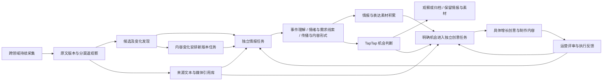

# V3：持续运行的 AI 情报与素材系统

当前版本：`3.0.0-alpha.10`。最新实现与非线性业务边界见[研究工具、时效与自动队列](V3-研究工具与自动队列.md)；下方旧版本段落保留对应时点记录，以最新契约为准。

当前 Alpha 9 的[主 Agent 与所属研究子 Agent](V3-主Agent与研究子Agent.md)已经落地；最新产品边界见[热点解读与游戏交付契约](V3-热点解读与游戏交付契约.md)。下面 Alpha 7 及更早说明保留其历史口径，不代表当前所有能力都已完成验收。

版本：3.0.0-alpha.7，2026-10-07。Alpha 6、Alpha 5、Alpha 4、Alpha 3、Alpha 2、Alpha 1、V2、V1 保留源码/运行库记录和旧入口。

Alpha 7 新增[按证据缺口研究与事件跟踪](V3-证据研究与事件跟踪.md)：正文、背景、真实讨论的工具计划和持续刷新，离线跨领域语义召回、稳定来源身份、关系核对与可撤回合并接入自动流程。评论样本与质量/时间范围进入情报契约 intelligence-v3.5，确认后共用来源并减少重复任务。189 项机制检查通过，真实热门评论取得，最新排序仍有失败；Zen 暂停保留，新增 AI 理解与自动创意为零。下面早期 Alpha 的实现与验证按原时点保留。

Alpha 6 补齐[跨领域来源与正文积累](V3-跨领域来源.md)：新增社会、文娱、生活新闻订阅和贴吧公开话题简介，每轮最多六次跨来源轮换读取，页面与 AI 输入标明实际范围；新闻发布不等于热点升温，旧闻不因重复采集重新入队。情报契约 intelligence-v3.4，旧版本记录保留。评论、传播语义归并和完整增长创意仍待验证。

Alpha 5 新增用户提供的 [太空兔官网 API 接入](V3-Space-Bunny.md)，与 Zen 独立。五档推理与默认、JSON 本地校验、请求与费用状态记录已实现；两次真实小请求均收到 502，未生成新情报或创意，未切换生产模型或解除 Zen 暂停。138 项本地检查等只能证明接口机制，模型与业务质量仍待真实验收。

Alpha 3 曾新增 [OpenCode Zen 原生任务接入](V3-OpenCode-Zen.md)，情报和创意阶段均可使用截图中的七个免费模型，实际模型需逐项验证。以下 Alpha 2 的采集及零后台 AI 交付记录保留为历史时点，Alpha 3 实测见版本记录。

目标原文：全网热点追踪，构建 AI 自动化情报与素材系统，通过热点识别产出与 TapTap 相关的实际增长创意。

## 产品主体与交付

产品主体是持续运转、不断积累的 AI 情报与素材系统。它从广泛领域主动发现线索、理解事件与人群需求、跟踪变化，整理真实来源、可复用表达和制作内容。情报和素材独立保留、更新、检索与复用，支持后续识别机会和制作创意。

增长创意是主要业务产出。每条应解释为什么值得做、吸引谁、创意是什么、如何传播、怎样承接到 TapTap、引导什么动作，并提供所需文案、脚本、视觉内容、素材依据与执行方法。实际投放和测量增长效果属于后续反馈，创意交付须具备具体内容和可执行条件。

情报理解、素材积累和增长创意需要一起验收。研究报告、字段齐全、来源数量和流程成功各自只证明一部分。社会、娱乐、文化、生活方式和游戏都应进入发现范围，后续根据实际需求与 TapTap 价值判断机会。

## Alpha 4 的交付升级

补读与模型分开：每周期最多补读两条已实现渠道的新闻正文或视频简介，按成功/失败保存读取范围、内容版本和重试时间；AI 退避期间仍可运行。补读后重新扫描内容版本，再安排情报，不能拿旧指纹提交新正文。新闻正文解析依赖已加入启动要求，视频简介标为 video_description，新闻片段标为 article_excerpt。

正文成功读取后，同一标题与 URL 的六小时有效详情不会被下一轮渠道摘要覆盖；指标观察继续更新。正文读取失败保留可用范围和重试记录，不能宣称已读取评论或视频转录。

机会表示待测试的增长假设，不是已证实的游戏需求或增长效果。非游戏热点可从真实生活、社会、文化需求提出 TapTap 的价值桥梁，必须同时写假设、可证伪的小规模验证和上线前条件；只有标题的资料仍不足以提出机会。

原生情报改用紧凑任务包，来源引用使用输入的整数 ref，程序映射回真实 ID 与逐字原文；模型不再重复填写 ID、指纹与引文。增长创意分为完整的方案规划和文案/脚本制作两个原生任务。AI 规划先入库，制作中断可按话题、内容版本、业务条件和模型复用；缺少制作内容的规划单独展示，不计为完整交付。旧情报与任务保留为历史，升级的情报契约使用 intelligence-v3.3。

确认 Zen 免费额度耗尽后，持久暂停整组 AI 任务，等待运营确认恢复再继续；采集、正文补读与素材积累照常。恢复时间未知，不使用猜测的重置时间；重启和切换 Zen 模型仍保留暂停，继续不会抹去供应商的实际限流退避。

Alpha 4 真实验收：新闻补读取得 399 字片段；暂停额度后的周期十个渠道取得 345 条渠道记录，模型调用为 0；两项 B 站详情读取失败并保留原范围与重试时间。本轮未取得新的 AI 情报、规划或自动增长创意。130 项本地检查、类型检查、生产构建和浏览器通过，这些只能证明机制与页面可运行。下一步须补齐跨领域内容读取，并在额度恢复后用真实样本检验增长创意质量。

## Alpha 2 的结构调整

Alpha 1 的 AI 情报和表达素材主要在一次创意任务内形成。Alpha 2 新增独立来源素材索引、持久情报任务、情报判断到创意任务的路由、共享模型退避和自动周期，形成持续处理流程。

自动运行：首次启动 V3 后端时初始化每 60 分钟运行一次，已有用户设置保留。后端关闭时停止。每周期实采渠道、同步已有采集文件、整理来源素材并更新候选任务；开启 AI 时最多处理两条情报、一个创意任务。界面展示实际启用状态、下一轮时间、独立阶段队列和退避原因。

模型日额度耗尽时，AI 任务保留并共享退避；采集、发现和来源素材整理继续。免费模型日额度错误退避六小时，一般限流十五分钟，账户错误一天，其他模型响应错误十分钟。这里的时间是系统重试策略，不代表供应商已经恢复。切换到未被退避的模型配置后，可以唤醒因模型故障延迟的任务，不自动切换到付费服务。

## 数据与处理契约

| 数据 | 保存与更新行为 | 当前边界 |
|---|---|---|
| `channel_observation` | 保留渠道、原内容、观察时间和榜内位置 | 不把跨平台数值合成全网热度 |
| `topic` / `topic_history` | 保存候选桶、成员、内容/信号版本与历史 | 严格标题归组用于召回，语义事件识别仍待质量验收 |
| `source_asset` / `source_asset_channel` | 实采文本/摘要、视频页面、文章页面及实采封面图引用；保存原文版本、读取范围和渠道 | 媒体引用未下载，视频未转录；标题热搜词不自动算素材 |
| `source_read` | 记录详情补读成功/失败、范围、内容版本、字数与重试时间 | 当前仅接入新闻正文和视频简介，失败不冒充已读 |
| `research_task` / `research_link` / `research_capability` | 保存计划、工具结果、剩余缺口和能力退避，关联直接讨论或待核对背景 | 规则计划不冒充 AI 理解，搜索不是热点证明 |
| `discussion_sample` / `discussion_observation` | 保留原帖、原评论、散列作者、文本去重及采样方法，持续刷新 | 有限一级样本，历史/低信息/邀请表达分别标记 |
| `tracked_event` / `tracked_member` / `tracked_change` | 稳定身份、内容与渠道时间线，确认关系后共享来源 | 初始来源记录是观察候选，观察顺序不证明首发/传播因果 |
| `event_relation` / `relation_history` / `relation_effect` | 五类关系、版本校验、实际判断及可逆成员变更 | 相似性只召回；未有真实标注集，不报告准确率 |
| `semantic_embedding` | 本机 BGE 按内容/版本缓存，无自动下载 | 缺本地模型时明确降级，不按分数合并 |
| `topic_intelligence` | 独立保存摘要、逐字引用、情绪/需求线索、传播机制、内容形式、可复用角度和未知 | AI 解读标为待核查推断，只读简介不代表观众/评论分析 |
| `work_item` | 情报与创意分开入队，版本幂等，尝试与退避持久化；过期或被替代的任务保留历史 | 中断任务按租约到期恢复，未实现任意工具步骤原位续跑 |
| `material` / `material_use` | 来源摘录、表达模式、原创文案、脚本、视觉方案与制作清单，保存版本/使用条件/复用关系 | 当前制作内容主要为文字和方案，图像/视频自动制作尚待实现 |
| `source_asset_use` | 创意复用来源素材时保存关联 | 关联说明引用用途，不代表商业授权 |
| `event` / `creative` | 保存实际依据、机会理由和具体增长创意，更新已有事件 | 可执行性与吸引力需真实运营评审，结构校验不能代替质量 |
| `creative_draft` | 保存真实 AI 规划，制作失败按话题/内容/条件/模型版本继续 | 未完成规划不计完整创意，旧版本继续保留 |
| `model_gate` | 持久保存实际供应商错误与系统重试时间 | 凭证存在不能证明额度或模型可用 |
| `settings.zen_quota` | 保存已确认额度耗尽后的整组 Zen 暂停与更新时间 | 确认恢复后继续，不假设额度重置时刻 |
| `cycle` / `run` / `step` | 保留采集、素材整理、任务安排、模型处理与失败过程 | 辅助交付与后台自动交付分别计数 |

来源素材和 AI 表达素材可以持续积累，即便没有新创意。情报可判为 `watch` 或 `archive`，并保存理解与素材；`opportunity` 需要说明用户需求、TapTap 价值桥梁和增长目标，然后进入创意任务。创意任务读取前序独立情报和来源素材，并保留使用关系。

情报按话题/内容信号版本和提示版本保存，创意任务另包含业务条件版本。重复观察不会重复安排同版任务，正文/有效信号变化后产生新任务。补读正文改变内容时，周期结束会重新扫描并安排后续版本分析，旧分析继续保留为历史。

当前运行库 `data/v3/agent.sqlite3` 与 V2 分开。复用 V2 的原文、认证、预算内核和既有连接器，升级必须运行 V2 回归。

## Alpha 2 真实验证

2026-10-07 本轮运行 `run_7b86e05750f74e939bda7afe0ed565f4`：十个已接入渠道实采成功，共 344 条渠道记录。覆盖百度综合/电影/电视剧/游戏、B 站全站热门/游戏榜、微博、贴吧、游戏媒体和 TapTap 发现页。这是六类平台十个渠道的抽样结果，不能称为全网覆盖或业务流量。

该时点来源素材库共有 446 条记录：来源文本/摘要 192、视频引用 80、文章引用 95、封面图引用 79。包括本轮实采和近期已有来源整理，并非 446 个制作成品；同一来源可能有多种类型或版本。后台独立情报任务 846 条，全部因已观察的免费模型日额度耗尽等待处理。

本轮模型决策次数为 0：系统采用之前真实 HTTP 429 错误的退避记录，没有重复请求已知不可用服务。来源、素材和待处理任务均保存成功。自动周期已初始化开启，每 60 分钟运行。

99 项本地检查通过，其中 V3 46 项（原有 24 加独立持续流程 22）、共用内核/V2 回归 53 项。覆盖来源素材幂等与版本、标题词不冒充素材、引用校验、观察/归档也积累、独立机会路由、租约恢复、供应商退避和切换恢复、业务条件版本、渠道轮换及复用记录。脚本模型仅在内存库中检查流程，不是模型质量或自动交付证据。TypeScript 和生产构建通过；实际 API、浏览器来源素材/草案检索、报告、角色限制和手机布局通过，页面错误为 0。实际重启保留自动周期与模型退避，后续同步新增一条来源素材，仍无重复模型调用；旧任务保留为被新版本替代的历史。验收文件为 `.toolchain/v3-alpha2-live-check.json`、`v3-alpha2-resume-check.json` 和 `v3-alpha2-browser-check.json`。

Alpha 1 的真实来源交互辅助样例保留，包含一条创意和五项表达/制作草案；该样例“反向旅游 → 反向找游戏”关联仍需评审，不能证明创意质量。后台自动增长交付仍为 0，后台独立 AI 情报分析仍为 0。没有用人工编写分析填充自动系统验收结果。

## 后续业务验收

1. **真实 AI 处理与创意质量**：模型恢复后验证独立理解、机会判断、素材提炼与创意制作。结构完整只是前提，须检验具体需求和产品价值、传播吸引力及实际承接能力。
2. **发现与分析覆盖**：当前任务每周期最多两条情报、一个创意，近期候选积压较多。需实现更高效的批量筛选、语义聚合、价值排序与分层处理，并用真实标注集检查漏发现、误合并和牵强关联，不能宣称分析覆盖已经达标。
3. **持续跟踪可靠性**：验证跨日运行、内容变化、过期、事件更新、供应商恢复和进程重启。当前只验证本轮实际处理和恢复机制。
4. **深度情报与素材制作**：补齐评论、视频转录、传播样本等真实内容读取；按创意管理图像/视频制作任务与产物，检验检索复用对实际制作的帮助。
5. **反馈闭环**：让运营对采用、修改、拒绝的理由和执行结果持续影响机会筛选、创意制作与后续跟踪；采用、发布和测得增长分别记录。

当前仍是 Alpha 架构升级和阶段实现，原业务目标尚未完成。Alpha 2 的意义是让系统持续运转与积累的能力开始独立成立，再通过真实模型和运营验收提高最终增长创意质量。
