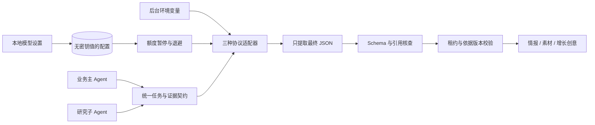

# V3 Alpha18：模型供应商与自定义配置

系统允许在本地工作台保存多份模型配置，再选择一份供业务主 Agent 和研究子 Agent 共用。一个供应商可以配多个模型或多套预算，不再需要修改 Python 的模型白名单。热点、情报、素材与增长创意的自动流程和两个 Agent 的分工沿用原有架构。

## 本地页面怎么配置

1. 启动 Python 后台，进入 V3 本地网页，以运营或管理员身份登录，点击页头的“模型设置”。观察账号和 GitHub Pages 公开成果页没有这个入口。
2. 在“配置来源”选择供应商预设或“自定义接口”。预设会填写基础地址、协议、示例模型、密钥变量名和参数方式；模型与地区地址应按自己供应商控制台确认。
3. 填写配置编号、显示名称及实际模型 ID。编号是这份配置的身份，例如 `qwen_fast` 和 `qwen_research` 可以属于同一家供应商。要新建另一份配置，修改编号；要修改已有配置，从“已保存配置”选择它。
4. 在后台运行机器的环境变量中设置密钥，页面只填写变量名。Windows 支持读取进程、用户及系统环境变量；其他平台使用进程环境。不要在此字段粘贴密钥值。
5. 选择该模型支持的推理与输出方式，点击“保存配置”。**保存未启用的配置不会调用模型，也不会改变当前供应商。**修改当前已启用配置后，后续自动运行使用新参数。
6. 在“自动运行的模型”选择已保存且凭证已配置的选项，点击“切换使用”。此后后台在既有自动计划中调用它，费用与额度由供应商决定。保存和切换均没有联网测试或试探调用。

后台正在执行时，配置编辑与切换会暂时锁定；结束后可以继续。每份配置独立保存推理方式、预算和接口设置，重启后保留。最多保存30份；本版没有删除配置功能。

配置入口独立读取供应商目录、当前模型、额度状态及运行租约，不等待完整成果总览。即使成果读取较慢或暂不可用，也能打开配置；保存／切换的成功状态来自配置接口，成果页后台刷新失败不会把已保存操作误报为失败。弹窗每15秒检查当前运行状态，写入时仍由后台在事务内核查租约。

以 OpenAI 为例，在运行后台的 PowerShell 中设置进程变量：

```powershell
$env:OPENAI_API_KEY = 'YOUR_API_KEY'
python -m uvicorn webapp.main:app --host 127.0.0.1 --port 8202
```

`YOUR_API_KEY` 是占位符，不是可用密钥。环境变量应进入后台进程；仅在另一个终端设置进程变量，不会修改已经运行的进程。页面、浏览器存储、SQLite 配置和 Git 仓库都不保存实际密钥。

## 已预填的主流供应商

这些是**可编辑的起始配置**，不是全部模型列表，也不是账户权限保证。模型 ID 可以填写供应商实际开放的其他型号。地区不同、服务版本不同、具体模型不同，支持的参数也可能不同。

| 供应商 | API 基础地址 | 示例模型 ID | 默认密钥变量 | 协议与推理方式 |
| --- | --- | --- | --- | --- |
| OpenAI | `https://api.openai.com/v1` | `gpt-5-mini` | `OPENAI_API_KEY` | Chat Completions；`reasoning_effort=low` |
| Anthropic / Claude | `https://api.anthropic.com/v1` | `claude-sonnet-4-6` | `ANTHROPIC_API_KEY` | Messages；`output_config.effort=low` |
| Google / Gemini | `https://generativelanguage.googleapis.com/v1beta/openai` | `gemini-2.5-flash` | `GEMINI_API_KEY` | OpenAI 兼容 Chat；`reasoning_effort=low` |
| xAI / Grok | `https://api.x.ai/v1` | `grok-4.7` | `XAI_API_KEY` | Responses；默认不附加推理参数 |
| DeepSeek 官方 | `https://api.deepseek.com` | `deepseek-flash` | `DEEPSEEK_API_KEY` | Chat；`thinking` 与 `reasoning_effort=low` |
| 阿里云百炼 / 千问 | `https://dashscope.aliyuncs.com/compatible-mode/v1` | `qwen-plus` | `DASHSCOPE_API_KEY` | Chat；默认 `enable_thinking=false` |
| 智谱 / GLM | `https://open.bigmodel.cn/api/paas/v4` | `glm-4.7` | `ZHIPU_API_KEY` | Chat；`thinking` 开关，默认不覆盖 |
| Moonshot / Kimi | `https://api.moonshot.cn/v1` | `kimi-k2.5` | `MOONSHOT_API_KEY` | Chat；`thinking` 开关，默认不覆盖 |
| MiniMax | `https://api.minimax.io/v1` | `MiniMax-M2.5` | `MINIMAX_API_KEY` | Chat；`reasoning_split=true` |
| 火山方舟 / 豆包 | `https://ark.cn-beijing.volces.com/api/v3` | 必须填写控制台模型 ID 或 `ep-*` 接入点 | `ARK_API_KEY` | Chat；`thinking` 开关，默认不覆盖 |
| 硅基流动 | `https://api.siliconflow.cn/v1` | `Qwen/Qwen3-8B` | `SILICONFLOW_API_KEY` | Chat；默认关闭思考，启用时预算分开计算 |
| OpenRouter | `https://openrouter.ai/api/v1` | `openrouter/free` | `OPENROUTER_API_KEY` | Chat；`reasoning` 对象，默认不覆盖 |
| Ollama 本地 | `http://127.0.0.1:11434/v1` | `qwen3:8b` | 无，默认不要求密钥 | Chat；不发送推理参数，允许本地 HTTP |

已有 DeepSeek 专用适配、太空兔直连接口、OpenCode Zen CLI 及历史 OpenRouter 接入继续可选；它们的原有额度暂停和历史运行记录保留。Ollama 需要先启动本地服务并准备模型，本项目不会替你下载权重；接口预设本身不证明本机硬件和模型满足业务质量要求。

## 自定义接入的边界

支持三种协议：

| 协议 | 请求终点与凭证 | 最终结果位置 |
| --- | --- | --- |
| `openai_chat` | 基础地址 + `/chat/completions`；Bearer 环境变量密钥 | `choices[0].message.content` |
| `openai_responses` | 基础地址 + `/responses`；Bearer 环境变量密钥 | `output` 中 assistant message 的 `output_text` |
| `anthropic_messages` | 基础地址 + `/messages`；`x-api-key`，固定 API 版本头 | `content` 的 text 块 |

可以接入兼容上述协议的自建网关、云服务或本地模型，不要求供应商名称在预设中。填写完整终点时，系统会移除对应终点后缀，避免重复拼接。基础地址不能包含账号密码、查询密钥或片段；HTTP 必须明确勾选允许。没有提供任意自定义请求体、认证头或工具回调脚本；不兼容这些协议的供应商需要新增适配器。

每次请求使用全新任务输入，不发送上次会话或推理上下文。Responses 明确发送 `store=false`；本地不保存原始响应或推理文本。这不代表所有供应商的服务端数据政策相同。

## 推理强度和输出预算怎么用

推理参数不是所有服务通用的字段。选择“不发送推理参数”可让接口使用自己的默认设置；`default` 也不是关闭思考。更换模型时应按其文档调整，不能把所有下拉选项视为每个模型都支持。

| 参数方式 | 本项目发送的内容 |
| --- | --- |
| `reasoning_effort` | Chat 使用顶层字段；Responses 使用 `reasoning.effort`，仅在明确选强度时发送 |
| `reasoning_object` | OpenRouter 的 `reasoning.effort` 或 `enabled=false` |
| `deepseek` | `thinking.type=enabled/disabled`；启用且选具体强度时再发送 `reasoning_effort` |
| `thinking` | 关闭时发送 `thinking.type=disabled`；默认不覆盖模型设置 |
| `enable_thinking` | 开关及独立 `thinking_budget`；开启以 token 预算控制，不虚构低中高参数 |
| `anthropic_effort` | `output_config.effort`；不发送 OpenAI 字段，也不将低强度解释为关闭思考 |

单次输出上限可设为256—32,768 token，实际请求取“用户上限”和“该业务阶段上限”的较小值。Chat 的 token 字段可选择 `max_tokens` 或 `max_completion_tokens`；Messages 使用 `max_tokens`，Responses 使用 `max_output_tokens`。

对于支持 `thinking_budget` 的服务，可指定128—32,768 token 思考预算。程序会在当前阶段总上限内压缩思考预算，给最终答案留出空间。硅基流动预设使用“分开预算”：从总上限先分配思考预算，再将剩余值作为 `max_tokens`，避免思考 token 额外扩大本次上限。关闭思考则不分配该预算。其他供应商的输出上限语义以具体接口为准；不支持独立思考预算的模型不会被发送 `thinking_budget`。

输出方式有三种：提示词约束 JSON、供应商 JSON Object 模式、供应商 JSON Schema 模式。Claude 没有 JSON Object 选项。原生 JSON Schema 的支持范围和 schema 子集因模型而异；预设优先采用保守配置，Claude、Gemini、Kimi、MiniMax、豆包和 Grok 默认用提示词 JSON。**所有模式最终都经过本地 JSON Schema、业务与证据契约校验**；不能靠打开原生结构化输出代替来源核查。

## 供应商变了，业务契约保持一致



- [`providers.py`](../agent_v3/providers.py) 管理预设、配置验证、持久化、凭证引用和配置指纹；[`provider_adapter.py`](../agent_v3/provider_adapter.py) 负责协议、请求参数、最终输出和用量转换。
- [`model.py`](../agent_v3/model.py) 在适配层外统一检查额度暂停和失败退避。没有跨供应商自动兜底，避免悄悄消费另一账户；同一接口与模型的配置别名共享失败退避。DeepSeek Flash 官方配置与既有专用接入共享持久额度暂停，改名不会解除暂停。
- [`contracts.py`](../agent_v3/contracts.py) 仍约束 Main 与 Research 的角色、任务 schema、输入指纹与证据引用；[`runtime_guard.py`](../agent_v3/runtime_guard.py) 交付时同时核查租约、图谱／来源版本以及所选模型配置版本。运行中参数发生变化时，旧交付不能写入成果。
- Chat 的 `reasoning_content`、`reasoning_details`，Responses 的 reasoning／encrypted 内容，Claude 的 thinking／signature 均不进入业务结果。最终文本空、截断、拒绝、工具封装、非 JSON 或非法引用会失败，不拿推理内容补齐答案。
- 任务轨迹只保留所选配置、实际返回模型、协议、配置版本、强度、输出预算、完成原因、耗时与供应商报告的 token 用量。失败的结构化交付在可用时保留已发生用量。推理 token 是统计信息，不会再加到已含推理的 completion／total 上造成重复计费。
- 供应商没有返回货币成本时记录 `provider_billed_not_reported`，金额未知；本版没有账户账单读取和全供应商价格推算。模型调用和研究 Tool Executor 的工具调用分别记录，模型自身并不绕过子 Agent 的工具预算。

请求不自动跟随重定向；输入上限500KB、响应上限2MB，网络和任务时间均受限。HTTP 错误只记录状态与简要原因，供应商错误正文和密钥不会进入运行日志。

## 验证与当前边界

Alpha18 新增20项离线测试，覆盖13套预设及三种协议的请求与响应、凭证不落库、配置保存／激活、额度暂停共享、退避隔离、并发修改拒绝、版本变化拒绝交付、用量统计、截断与推理文本隔离，以及**全部13套配置执行相同的 Main／Research 业务与引用契约**。完整回归和前端检查见[版本记录](版本记录.md)。

浏览器使用正式数据的独立备份和没有调度器的隔离 API，验证保存不激活、切换后刷新保留、Claude 与 Responses 预设、观察角色限制、键盘关闭／焦点恢复及390px布局。正式后台没有增加测试配置，也没有切换模型。本轮没有付费调用；因此验证的是适配与运行机制，不宣称13家供应商都已用真实账户在线验收。账户权限、地区网络和实际模型业务质量需在有额度时检验。

## 官方文档核对入口

接口参考截至2026-10-09；模型与能力会变动，控制台和当前官方文档优先。

- [OpenAI Chat Completions 参数](https://developers.openai.com/api/reference/resources/chat/subresources/completions/methods/create)、[Responses 迁移](https://developers.openai.com/api/docs/guides/migrate-to-responses)
- [Claude Messages](https://platform.claude.com/docs/en/api/messages/create)、[effort](https://platform.claude.com/docs/en/build-with-claude/effort)、[结构化输出](https://platform.claude.com/docs/en/build-with-claude/structured-outputs)
- [Gemini 的 OpenAI 兼容接口](https://ai.google.dev/gemini-api/docs/openai)、[xAI 文本生成](https://docs.x.ai/developers/model-capabilities/text/generate-text)
- [DeepSeek 思考模式](https://api-docs.deepseek.com/guides/thinking_mode/)、[百炼 OpenAI 兼容](https://help.aliyun.com/zh/model-studio/compatibility-of-openai-with-dashscope)
- [硅基流动 Chat 参数](https://docs.siliconflow.cn/docs/api/chat-completions-post)、[OpenRouter API](https://openrouter.ai/docs/api_reference/overview)、[Ollama 兼容接口](https://docs.ollama.com/api/openai-compatibility)
