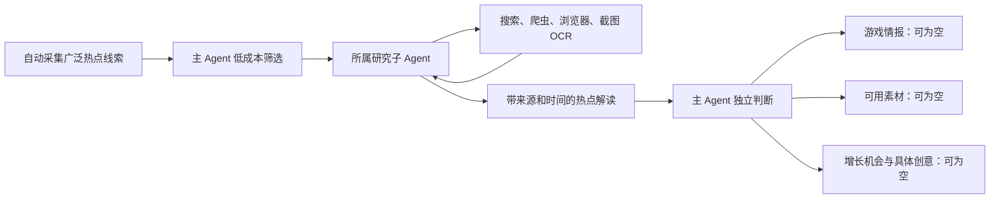

# V3 Alpha 10：研究工具、时效与自动队列

2026-10-08，版本 `3.0.0-alpha.10`。保留 Alpha 9 和此前源码、运行记录；本次没有删除文件。

## 一个主 Agent 与一个研究子 Agent

主 Agent 负责筛选与业务判断，研究子 Agent 负责按问题取证、核对事件并交付热点解读。情报、素材、增长创意是三类独立成果，不是三个必经步骤，也不增加三个 Agent。

创意需要有来源、近期时机、真实业务条件与机会判断，允许直接从热点形成方案；不依赖先生成游戏情报或既有素材。内部 `topic_intelligence` 为兼容既有版本继续保存主 Agent 的业务判断，不意味着必须产出一条对外游戏情报。

## 研究工具实际能力

- `read_detail`：已有公开来源爬虫/正文连接器，优先使用。
- `search_web` / `search_news`：联网搜索与新闻搜索，命中不自动等于同一事件、已读正文或近期热度。Bing RSS 的明显无关结果被过滤；无相关结果时按预算尝试浏览器搜索。
- `browse_page`：隔离的 Edge 浏览器加载动态页面、读取可见文字并留截图。没有用户登录状态，不自动登录，不操控发布。
- `screenshot_ocr`：有限滚动最多三屏，截图后调用本机 Windows 简体中文 OCR。返回文字、每个词的坐标、原始识别文本与图片 SHA-256，AI 接收的是标注过的文字转录，不宣称 DeepSeek 直接理解图片。
- `sample_discussion`：已有真实评论采样连接器。页面文字和 OCR 文字不直接冒充评论样本，广告、导航不当作用户需求。

HTTP 补读未成功会尝试浏览器；浏览器文字仍不足会尝试截图 OCR。研究模型可以主动选择这些工具，并依据第一轮结果再规划一轮，读取刚搜到的来源或修改检索词。每次研究周期最多六次来源工具调用、最多两轮规划；浏览器内部还限制时间和请求量。失败和缓存都保留，不无限调用。

截图不能取得页面根本没有提供的内容，验证码、403、频率限制或登录墙也可能仍然阻止读取。访问限制保留截图用于核查，不能计为事件正文。OCR 可能错字，没有识别置信度则明确为空；研究解读保留局限，原图可从产品的研究核查入口查看。

运行依赖 Node.js、Playwright、Edge 和 Windows 简体中文 OCR。当前电脑已具备；可用 `V3_BROWSER_NODE`、`V3_PLAYWRIGHT_MODULE`、`V3_BROWSER_EXECUTABLE` 指定运行路径。截图保存在 `data/v3/research_captures/`；源代码快照不包含这些原始采集文件。截图 API 要求现有登录凭证。

实现依据：[Playwright 浏览器页面与截图接口](https://playwright.dev/docs/api/class-page)、[Microsoft Windows OCR 接口](https://learn.microsoft.com/en-us/uwp/api/windows.media.ocr.ocrengine.recognizeasync?view=winrt-26100)。B 站优先抽取标题与简介区域，减少推荐内容污染；不宣称观看或转录了视频。

## 一周时效与旧内容翻红

候选、业务判断和创意交付以近七天为默认窗口。发布时间、事件时间、榜单观察时间分别保存，采集时间不替代事件时间。

旧内容只有近期传播变化的依据才能作为翻红研究：真实同榜排名上升，或不同作者的近期有效评论样本。单纯再次采到、仍在榜单、日期未知的导入 ranking 不构成翻红依据；近期评论也不证明全网爆火。近期报道如果研究确认只讲历史事件，同样退出当前热点。

研究返回独立的时间判断与逐字时间引文；新增日期必须能和引文解析的日历日期对应。对背景网页核对对象、行为和时间，只有同一事件的已读正文才补足直接标题的语境。未核实搜索摘要不能补成已读正文。

2025 年《崩坏：星穹铁道》短片的旧解读仍保存，但当前没有近期翻红证据时不再进入当前热点，也不继续按当前热点制作业务成果。历史材料可以作为引用或模板保留，使用时应核查当前适用场景，不能冒充今天的新事件。

## 自动推进与复查

修复原先反复取同一批前 18 条候选的问题。每轮筛选未处理记录，给近期游戏来源保留可推进的席位；已归档或已完成的判断不会一直占着输入窗口。页面把“待自动初筛”与已研究/观察/归档分开。

采集保留用户已有间隔。启用自动研究时，在采集周期之间每十五分钟继续推进 AI 队列；每轮最多初筛 18 条、深入处理两个话题、制作一个机会的创意。额度/供应商退避继续生效，不承诺把每条候选都变成成果。观察判断有六小时复查时间，含具体缺口的问题交还研究子 Agent；交付失败按重试时间退避。

## 验证与尚未完成

本次已有回归验证覆盖 OCR 文字入库与来源身份、截图可回溯、验证码内容不入正文、空 OCR 不伪装成功、私网拒绝、爬虫→浏览器→OCR 的预算、七天边界、旧内容仅上榜不算翻红、候选窗口推进、无情报/素材仍可制作创意。真实网页已完成 Edge 加载、三屏截图与本地 OCR。

302项检查、类型检查与生产构建通过。未指定候选的真实周期实现412后浏览器读取、留图、三条近期评论和两项素材；一个时间交付延期后已分项修复，不称整个目标完成。真实B站截图OCR与桌面/手机页面检查通过。源码/SQLite/截图快照和恢复结果在版本记录追加。长期无人干预产出质量、全网覆盖、复杂事件聚类和实体/关系归纳、素材质量评估与实际增长效果仍需持续验收。本次接入工具不等于这些目标全部完成。
